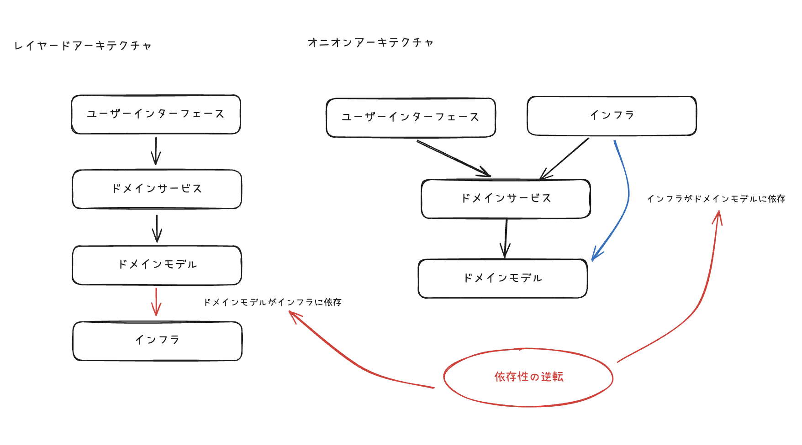

### 課題1-1

オニオンアーキテクチャを図解してください。その際、以下の概念を必ず含めてください。

- ドメインモデル
- ドメインサービス
- インフラ
- ユーザインターフェース

- 

### 課題1-2

中心に位置するドメインモデル層は他のどの層にも依存していません。こうすることに、どのようなメリットがあるのでしょうか？

- ドメインモデルの変更が他の層に依存しないことがメリット
  - 前提として、ビジネスロジックは状況によってよく変わりうるもの
  - ビジネスロジックの変更が理由で、他の層への変更が伝搬しないことで、修正箇所を最小限にできる

### 課題1-3

層をまたいで依存関係が発生する時（例えばユースケース層がレポジトリ層のメソッドを呼び出す時など）はインターフェースに対する依存のみ許可します。こうすることに、どのようなメリットがあるのでしょうか？

- 実装(今回はレポジトリ層のメソッド)が変わったとしても、インターフェースが変わらない限り、呼び出し側の変更は不要になる
- レポジトリのメソッドが大幅に変わったとしても同じで、RDB→NoSQLに変えたとしても、呼び出し側へその変更が依存しないことを確約できること  

### 課題1-4

「依存性の逆転」がオニオンアーキテクチャにおいてどのように使われているのか説明してください

- オニオンアーキテクチャの生まれた背景から考える
  - レイヤードアーキテクチャ
    - UI → Application →　Domain → Infrastructure
    - このようにDomainクラスがInfrastructureに依存している。が、Infrastructureの変更がDomain層に影響してしまうことを問題と捉えている
    - ビジネス的に考えると一番重要なレイヤーはDomainが、ビジネス的には興味のないInfrastructureに依存しているのが問題
- オニオンアーキテクチャでは、Infrastructure層の依存Domain層に向けるときに、依存性の逆転をつかっている

-  
    
### 課題1-5

特定のユーザにしかリソースの追加や更新を許さないようなアクセス制限機能を実装したいとします。どの層に記述するのが適切でしょうか？（これは開発者によって意見が割れると思いますので、様々な観点から根拠を集めてみてください！）
 
- アプリケーションサービス層
  - アクセス制限をシステム的な権限管理と捉えるなら、ビジネスロジックではないので、ドメイン層にはいるのはおかしいから、アプリケーションサービス層に書くべきと言えそう

- ドメインサービス層
  - アクセス制限によって売上が変わるなどであれば、ドメインサービス層に書くべきものになると考えられそう
    - Free、Pro、Enterpriseっていう3つのUserがあって、それによって料金もできることも違うという機能を提供しているなら、アクセス制御はドメインサービス層にあるべきだと思う

### 課題1-6

データベースをMySQLからPostgreSQLに変更するとします。どの層を変更する必要があるでしょうか？

- インフラ層
  - データベースはアプリケーションから見ると、外部のリソースでビジネスロジックに直接関係あるものでもない

### 参考
- [オニオンアーキテクチャで実現した 本質課題を解決する インフラ移行の実例](https://speakerdeck.com/hryushm/onion-architecture-infrastructure-migration)
- [ドメイン駆動設計(DDD)・オニオンアーキテクチャとは？](https://qiita.com/k_yamaki/items/bf99d3bf64a84258a3a1)
- [オニオンアーキテクチャとは何か](https://qiita.com/cocoa-maemae/items/e3f2eabbe0877c2af8d0)
- [クリーンアーキわからんかった人のためのオニオンアーキテクチャ](https://zenn.dev/streamwest1629/articles/no-clean_hello-onion-architecture)
- [Onion Architecture](https://medium.com/expedia-group-tech/onion-architecture-deed8a554423)

### メモ

- ドメインサービスとアプリケーションサービスの違いってなんやろ
  - [混乱しがちなサービスという概念について](https://blog.j5ik2o.me/entry/2016/03/07/034646)