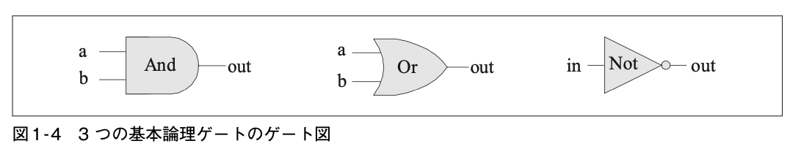

# 1. ブール論理

## 論理ゲート

ゲート(Gate)は、ブール関数を実装する物理的なデバイスのこと。  

[参考 Wiki - 論理回路](https://ja.wikipedia.org/wiki/%E8%AB%96%E7%90%86%E5%9B%9E%E8%B7%AF)

ブール代数とブール関数をつかって、論理ゲートを実装していく。  

ブール代数はブール値(真理値)を扱う。  
通常は、true/false, 1/0, yes/no, on/offなどが使われる。  

### ブール関数

ブール関数(ブール演算子)は、入力としてブール値を受けとり、出力としてブール値を返す。  

### Nand

Not Andの略で Nand(x,y) = Not(And(x,y)) と等価になる。  

**ブール関数**
| x | y | NAND(x, y) |
|---|---|------------|
| 0 | 0 |     1      |
| 0 | 1 |     1      |
| 1 | 0 |     1      |
| 1 | 1 |     0      |

**API形式**  
チップ名：Nand  
入力： a, b  
出力： out  
関数： if((a == 1) and (b == 1) then out = 0, else out = 1)  




### And

**ブール関数**
| x | y | x and y |
|---|---|---------|
| 0 | 0 |    1    |
| 0 | 1 |    0    |
| 1 | 0 |    0    |
| 1 | 1 |    1    |

**API形式**  
チップ名：And  
入力： a, b  
出力： out  
関数： if((a == 1) and (b == 1)) then out = 1, else out = 0  

**HDL**
```
CHIP And {
    IN a, b;
    OUT out;
    
    PARTS:
    Nand(a= a, b= b, out= nand);
    Not(in= nand, out= out);

}
```
### Or

**ブール関数**
| x | y | x or y |
|---|---|--------|
| 0 | 0 |   0    |
| 0 | 1 |   1    |
| 1 | 0 |   1    |
| 1 | 1 |   1    |

**API形式**  
チップ名：Or  
入力： a, b  
出力： out  
関数： if((a == 0) and (b == 0)) then out = 0, else out = 1  

**HDL**
```
CHIP Or {
    IN a, b;
    OUT out;

    PARTS:
    Not(in= a, out= notA);
    Not(in= b, out= notB);
    And(a= notA, b= notB, out= andOut);
    Not(in= andOut, out= out);
}
```


### Not

1入力のNotゲートのことをインバータと呼ばれる。

**ブール関数**
| x | not x | 
|---|-------|
| 0 |   1   |
| 1 |   0   |

**API形式**  
チップ名：Not  
入力： in  
出力： out  
関数： if(in == 0) then out = 1, else out = 0  

**HDL**
```
CHIP Not {
    IN in;
    OUT out;

    PARTS:
    Nand(a= in, b= in, out= out);
}
```

### Xor

排他的論理和(Exclusive Or)と呼ぶ。

**ブール関数**
| x | y |  Xor   |
|---|---|--------|
| 0 | 0 |   0    |
| 0 | 1 |   1    |
| 1 | 0 |   1    |
| 1 | 1 |   0    |

**API形式**  
チップ名：Xor  
入力： a, b  
出力： out  
関数： if(a != b) then out = 1, else out = 0  

**HDL**
```
CHIP Xor {
    IN a, b;
    OUT out;

    PARTS:
    Not(in= a, out= notA);
    Not(in= b, out= notB);
    And(a= a, b= notB, out= aAndNotB);
    And(a= notA, b= b, out= notAAndB);
    Or(a= aAndNotB, b= notAAndB, out= out);
}
```

## マルチプレクサ - Mux

3入力のゲートで、データビットと選択ビットを受け取って、1つ出力する。    

**ブール関数**
| a | b | sel | out |
|---|---|-----|-----|
| 0 | 0 |  0  |  0  |
| 0 | 1 |  0  |  0  |
| 1 | 0 |  0  |  1  |
| 1 | 1 |  0  |  1  |
| 0 | 0 |  1  |  0  |
| 0 | 1 |  1  |  1  |
| 1 | 0 |  1  |  0  |
| 1 | 1 |  1  |  1  |
 
**簡易版ブール関数**
| sel | out | 
|-----|-----|
|  0  |  a  |
|  1  |  b  |

**API形式**  
チップ名：Mux  
入力： a, b, sel    
出力： out  
関数： if(sel == 0) then out = a, else out = b  

**HDL**

```
CHIP Mux {
    IN a, b, sel;
    OUT out;

    PARTS:
    Not(in= sel , out= notSel);
    And(a= a, b= notSel, out=aAndNotSel);
    And(a= b, b= sel, out=bAndSel);
    Or(a= aAndNotSel, b= bAndSel, out=out);
}
```

## デマルチプレクサ - Dmux

マルチプレクサと逆のことを行い、1つの入力を受取、選択ビットに従って2つの出力どちらかに振り分ける。  

**ブール関数**
| sel |  a  |  b  |
|-----|-----|-----|
|  0  |  in |  0  |
|  1  |  0  |  in |

**API形式**  
チップ名：DMux  
入力： in, sel    
出力： a, b  
関数： if(sel == 0) then {a, b} = {in, 0},  
      else              {a, b} = {0, in}  

**HDL**
```
CHIP DMux {
    IN in, sel;
    OUT a, b;

    PARTS:
    Not(in= sel, out= notSel);
    And(a= in, b= notSel, out= a);
    And(a= in, b= sel, out= b);
}
```

## 複数ビットNot

n ビットのNotゲートは、入力されたnビットの各ビットに対してNot演算を行う。  

**API形式**  
チップ名：Not16  
入力：in[16]  
出力：out[16]  
関数：for i = 0..15 out[i] = Not(in[i])  

**HDL**
```
CHIP Not16 {
    IN in[16];
    OUT out[16];

    PARTS:
    Not(in= in[0], out= out[0]);
    Not(in= in[1], out= out[1]);
    Not(in= in[2], out= out[2]);
    Not(in= in[3], out= out[3]);
    Not(in= in[4], out= out[4]);
    Not(in= in[5], out= out[5]);
    Not(in= in[6], out= out[6]);
    Not(in= in[7], out= out[7]);
    Not(in= in[8], out= out[8]);
    Not(in= in[9], out= out[9]);
    Not(in= in[10], out= out[10]);
    Not(in= in[11], out= out[11]);
    Not(in= in[12], out= out[12]);
    Not(in= in[13], out= out[13]);
    Not(in= in[14], out= out[14]);
    Not(in= in[15], out= out[15]);
}
```

## 複数ビットAnd

n ビットのAnd ゲートは2つのnビットを入力とし、ペア同士のビットでAnd演算を行う。  

**API形式**  
チップ名：And16  
入力：a[16], b[16]  
出力：out[16]  
関数：for i = 0..15 out[i] = And(a[i], b[i])  

**HDL**
```
CHIP And16 {
    IN a[16], b[16];
    OUT out[16];

    PARTS:
    //// Replace this comment with your code.
    And(a=a[0], b=b[0], out=out[0]);
    And(a=a[1], b=b[1], out=out[1]);
    And(a=a[2], b=b[2], out=out[2]);
    And(a=a[3], b=b[3], out=out[3]);
    And(a=a[4], b=b[4], out=out[4]);
    And(a=a[5], b=b[5], out=out[5]);
    And(a=a[6], b=b[6], out=out[6]);
    And(a=a[7], b=b[7], out=out[7]);
    And(a=a[8], b=b[8], out=out[8]);
    And(a=a[9], b=b[9], out=out[9]);
    And(a=a[10], b=b[10], out=out[10]);
    And(a=a[11], b=b[11], out=out[11]);
    And(a=a[12], b=b[12], out=out[12]);
    And(a=a[13], b=b[13], out=out[13]);
    And(a=a[14], b=b[14], out=out[14]);
    And(a=a[15], b=b[15], out=out[15]);
}
```

## 複数ビットOr

n ビットのOrゲートは2つのnビットを入力とし、ペア同士のビットでOr演算を行う。  

**API形式**  
チップ名：Or16  
入力：a[16], b[16]  
出力：out[16]  
関数：for i = 0..15 out[i] = Or(a[i], b[i])  

**HDL**
```
CHIP Or16 {
    IN a[16], b[16];
    OUT out[16];

    PARTS:
    //// Replace this comment with your code.
    Or(a=a[0], b=b[0], out=out[0]);
    Or(a=a[1], b=b[1], out=out[1]);
    Or(a=a[2], b=b[2], out=out[2]);
    Or(a=a[3], b=b[3], out=out[3]);
    Or(a=a[4], b=b[4], out=out[4]);
    Or(a=a[5], b=b[5], out=out[5]);
    Or(a=a[6], b=b[6], out=out[6]);
    Or(a=a[7], b=b[7], out=out[7]);
    Or(a=a[8], b=b[8], out=out[8]);
    Or(a=a[9], b=b[9], out=out[9]);
    Or(a=a[10], b=b[10], out=out[10]);
    Or(a=a[11], b=b[11], out=out[11]);
    Or(a=a[12], b=b[12], out=out[12]);
    Or(a=a[13], b=b[13], out=out[13]);
    Or(a=a[14], b=b[14], out=out[14]);
    Or(a=a[15], b=b[15], out=out[15]);
}
```

## 複数ビットマルチプレクサ

**API形式**  
チップ名：Mux16  
入力：a[16], b[16], sel  
出力：out[16]  
関数：if(sel == 0) then for i = 0..15 out[i] = a[i],  
     else for i = 0..15 out[i] = b[i]  

**HDL**
```
CHIP Mux16 {
    IN a[16], b[16], sel;
    OUT out[16];

    PARTS:
    //// Replace this comment with your code.
    Mux(a=a[0], b=b[0], sel=sel, out=out[0]);
    Mux(a=a[1], b=b[1], sel=sel, out=out[1]);
    Mux(a=a[2], b=b[2], sel=sel, out=out[2]);
    Mux(a=a[3], b=b[3], sel=sel, out=out[3]);
    Mux(a=a[4], b=b[4], sel=sel, out=out[4]);
    Mux(a=a[5], b=b[5], sel=sel, out=out[5]);
    Mux(a=a[6], b=b[6], sel=sel, out=out[6]);
    Mux(a=a[7], b=b[7], sel=sel, out=out[7]);
    Mux(a=a[8], b=b[8], sel=sel, out=out[8]);
    Mux(a=a[9], b=b[9], sel=sel, out=out[9]);
    Mux(a=a[10], b=b[10], sel=sel, out=out[10]);
    Mux(a=a[11], b=b[11], sel=sel, out=out[11]);
    Mux(a=a[12], b=b[12], sel=sel, out=out[12]);
    Mux(a=a[13], b=b[13], sel=sel, out=out[13]);
    Mux(a=a[14], b=b[14], sel=sel, out=out[14]);
    Mux(a=a[15], b=b[15], sel=sel, out=out[15]);
}
```

## 複数入力Or

**API形式**  
チップ名：Or8Way  
入力：in[8]  
出力：out  
関数：out = Or(in[0], in[1], ...., in[7])  

**HDL**
```
CHIP Or8Way {
    IN in[8];
    OUT out;

    PARTS:
    //// Replace this comment with your code.
    Or(a=in[0], b=in[1], out=or01);
    Or(a=in[2], b=in[3], out=or23);
    Or(a=in[4], b=in[5], out=or45);
    Or(a=in[6], b=in[7], out=or67);
    
    Or(a=or01, b=or23, out=or0123);
    Or(a=or45, b=or67, out=or4567);
    
    Or(a=or0123, b=or4567, out=out);
}
```

## 複数入力/複数ビットのマルチプレクサ


**HDL**
```
CHIP Mux4Way16 {
    IN a[16], b[16], c[16], d[16], sel[2];
    OUT out[16];
    
    PARTS:
    // sel 0 による絞り込み
    Mux16(a= a, b=b, sel= sel[0], out= abOut0);
    Mux16(a=c, b=d, sel=sel[0], out=cdOut0);
    // sel 1 による絞り込み
    Mux16(a=abOut0, b=cdOut0, sel=sel[1], out=out);
}
```

**HDL**
```
CHIP Mux8Way16 {
    IN a[16], b[16], c[16], d[16],
       e[16], f[16], g[16], h[16],
       sel[3];
    OUT out[16];

    PARTS:
    // sel0で絞り込み
    Mux16(a= a, b=b, sel= sel[0], out= abOut0);
    Mux16(a=c, b=d, sel=sel[0], out=cdOut0);
    Mux16(a=e, b=f, sel=sel[0], out=efOut0);
    Mux16(a=g, b=h, sel=sel[0], out=ghOut0);

    // sel 1 による絞り込み
    Mux16(a=abOut0, b=cdOut0, sel=sel[1], out=abcdOut1);
    Mux16(a=efOut0, b=ghOut0, sel=sel[1], out=efghOut1);

    // sel 2による絞り込み
    Mux16(a=abcdOut1, b=efghOut1, sel=sel[2], out=out);    
}
```

## 複数入力/複数ビットのデマルチプレクサ


**HDL**
```
CHIP DMux4Way {
    IN in, sel[2];
    OUT a, b, c, d;

    PARTS:
    DMux(in= in, sel= sel[1] , a= upper, b= lower);
    DMux(in= upper, sel= sel[0] , a= a, b= b);
    DMux(in= lower, sel= sel[0] , a= c, b= d);   
}
```

**HDL**
```
CHIP DMux8Way {
    IN in, sel[3];
    OUT a, b, c, d, e, f, g, h;

    PARTS:
    DMux(in=in, sel=sel[2], a=upper, b=lower);
    
    DMux(in=upper, sel=sel[1], a=upperLeft, b=upperRight);
    DMux(in=lower, sel=sel[1], a=lowerLeft, b=lowerRight);
    
    DMux(in=upperLeft, sel=sel[0], a=a, b=b);
    DMux(in=upperRight, sel=sel[0], a=c, b=d);
    DMux(in=lowerLeft, sel=sel[0], a=e, b=f);
    DMux(in=lowerRight, sel=sel[0], a=g, b=h);
}
```

