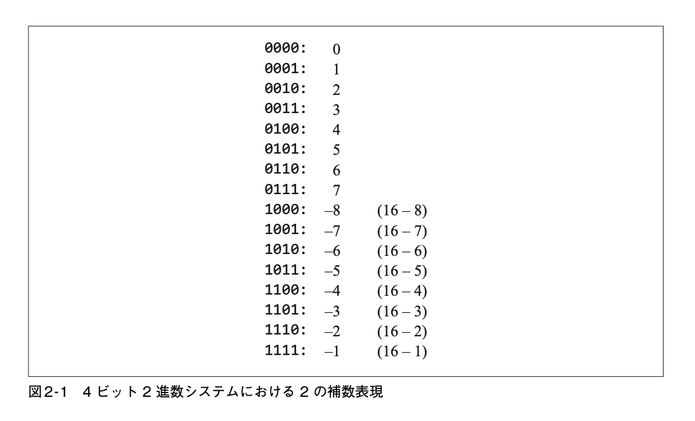

# 2. ブール算術

## 算術演算

### 加算

### 符号変換

### 減算

### 乗算

### 除算

### 比較

## 2進数

コンピュータの内部ではあらゆるものがバイナリコードで表される。  
- 素数の例は？で1キー、9キー、Enterキーと順に押すと、コンピュータのメモリには、10011というバイナリコードが格納される  
- その素数を画面に表示するようにコンピュータに依頼すると、OSが10011を10進数に変換して、19であることがわかる。その後、整数値を「1」と「9」という文字に変換する
- そして、現在のフォントを調べて、2つの文字のビットマップ画像を取得して、画面ドライバに画面のピクセルを操作させ、19という数字が画面に表示される。

- バイナリ表現
  - コンピュータがデータを処理する際に「0」と「1」の2進数で表現するデータ形式

- ビットマップ画像
    - https://wa3.i-3-i.info/word18544.html

## 固定ワードサイズ

- コンピュータが基本的な処理単位を表現するのに使用するビット数のこと。
    - 整数は無限に続く、がコンピュータは有限の機会なので、数を表現するために決まったサイズを使う
- 整数表現するとき
    - 8,16,32,64ビットのレジスタが使われる。このレジスタは固定のサイズ
    - プログラミング言語のデータ型でいうと、8bit = byte, 16bit = short, 32bit = int, 64bit = longに対応する。
    - nビット使うと、0から2^n-1までの整数を表現できる

- レジスタ
    - コンピュータのCPUの中にある、データを一時的に保存する記憶装置
    - https://wa3.i-3-i.info/word1518.html

- レジスタの範囲を超えた数値をどう扱っているのか
    - 一般的には、数値を表現するのに必要な数だけ、nビットのレジスタを並べて実装される。

## 2進数の加算

- 最下位ビット(Least Significant Bit)
    - 一番右の桁
- キャリービット(桁上りビット)
    - 最下位ビットの加算で、桁が上がった場合に、その桁の値
- 最上位ビット(Most Significant Bit)
    - 一番左の桁

- オーバーフロー
    - 最上位ビットの加算の和で、そのキャリービットの値が1のときはオーバーフローが発生したことになる。
    - オーバーフローにどう対応するかは設計者次第
    - 無視するという選択肢もあり、その場合は、2つのnビットを加算した結果が決めたnビットまで正しいことを保証すれば良いという考え方になる。
- オーバーフローの例
    - 8bitのレジスタで、127 + 1を計算すると、-128になる。
    - この場合、オーバーフローが発生している。
    - オーバーフローが発生した場合、コンピュータはその結果を無視して、エラーを返す。

## 符号付き2進数

- バイナリコードで符号付き数字(正と負)を表現するには、2^n通りの領域を2つにわけることが自然な方法になる。
- 現代ほとんどすべてのコンピュータで用いられる方式が、2の補数と呼ばれる方式
  - 別名、基数の補数とも呼ばれる
- nビットのワードサイズで2の補数を使うと、マイナスx = 2^n - x となる。
  - 4ビットのワードサイズで -7 を表すとすると、2^4 - 7 = 9 となる。
  - つまり、-7 は 9 という数値を表すことになる。
  - このように、2の補数を使うと、マイナスの数値を表現できる。



- 2の補数のメリット
    - 2^n個の符号付き整数を表すことができる
    - 範囲は -(2^(n-1)) から 2^(n-1) - 1 まで
    - 非負の数のコードは先頭ビットの値が1から始まる
    - 負の数のコードは先頭ビットの値が1から始まる
    - xのバイナリコードから-xのバイナリコードを得るには、
        - xの「最下位ビット」と「一番右側の1ビット」を反転させて、その結果に1を足すと実現できる
        - xのすべてのビットを反転させて、その結果に1を足すことで実現できる
    - 加算と減算がどうように扱える

## 加算器

### 半加算器
- 2つのビットの和を求めるチップ

**API形式**  
チップ名：HalfAdder  
入力： a, b  
出力： sum, carry
関数： sum   = a + b の最下位ビット  
      carry = a + b の最上位ビット
  
**HDL**
```
CHIP HalfAdder {
    IN a, b;    // 1-bit inputs
    OUT sum,    // Right bit of a + b 
        carry;  // Left bit of a + b

    PARTS:
    Xor(a = a, b = b, out = sum); // 2つの入力が異なるときに1になる性質を利用
    And(a= a, b= b, out= carry);// 2つの入力が同じときに繰り上がる性質を利用
}
```

### 全加算器
- 3つのビットの和を求めるチップ

**API形式**  
チップ名：FullAdder  
入力： a, b, c  
出力： sum, carry
関数： sum   = a + b + c の最下位ビット  
      carry = a + b + c の最上位ビット  

**HDL**
```
CHIP FullAdder {
    IN a, b, c;  // 1-bit inputs
    OUT sum,     // Right bit of a + b + c
        carry;   // Left bit of a + b + c

    PARTS:
    HalfAdder(a= a, b= b, sum= sumAB, carry= carryAB);
    HalfAdder(a= sumAB, b= c, sum= sum, carry= carryABC);
    Or(a= carryAB, b= carryABC, out= carry);
}
```

### 加算器
- 2つのビットの和を求めるチップ  

**API形式**  
チップ名：Add16  
入力： a[16], b[16]  
出力： out[16]
関数： 2つの16ビットの数を加算する。  
      オーバーフローは無視される。  

**HDL**
```
CHIP Add16 {
    IN a[16], b[16];
    OUT out[16];

    PARTS:
    FullAdder(a=a[0], b=b[0], c=false, sum=out[0], carry=c1);
    FullAdder(a=a[1], b=b[1], c=c1, sum=out[1], carry=c2);
    FullAdder(a=a[2], b=b[2], c=c2, sum=out[2], carry=c3);
    FullAdder(a=a[3], b=b[3], c=c3, sum=out[3], carry=c4);
    FullAdder(a=a[4], b=b[4], c=c4, sum=out[4], carry=c5);
    FullAdder(a=a[5], b=b[5], c=c5, sum=out[5], carry=c6);
    FullAdder(a=a[6], b=b[6], c=c6, sum=out[6], carry=c7);
    FullAdder(a=a[7], b=b[7], c=c7, sum=out[7], carry=c8);
    FullAdder(a=a[8], b=b[8], c=c8, sum=out[8], carry=c9);
    FullAdder(a=a[9], b=b[9], c=c9, sum=out[9], carry=c10);
    FullAdder(a=a[10], b=b[10], c=c10, sum=out[10], carry=c11);
    FullAdder(a=a[11], b=b[11], c=c11, sum=out[11], carry=c12);
    FullAdder(a=a[12], b=b[12], c=c12, sum=out[12], carry=c13);
    FullAdder(a=a[13], b=b[13], c=c13, sum=out[13], carry=c14);
    FullAdder(a=a[14], b=b[14], c=c14, sum=out[14], carry=c15);
    FullAdder(a=a[15], b=b[15], c=c15, sum=out[15], carry=c16);
}
```

### インククリメンタ

**API形式**  
チップ名：Inc16  
入力： in[16]  
出力： out[16]
関数： out = in + 1   
      オーバーフローは無視される。  

**HDL**
```
CHIP Inc16 {
    IN in[16];
    OUT out[16];

    PARTS:
    Add16(a=in, b[0]=true, b[1]=false, b[2]=false, b[3]=false,
          b[4]=false, b[5]=false, b[6]=false, b[7]=false,
          b[8]=false, b[9]=false, b[10]=false, b[11]=false,
          b[12]=false, b[13]=false, b[14]=false, b[15]=false,
          out=out);
}
```

## ALU （算術論理演算器）

- 算術演算と論理演算を計算するように設計されたチップ

仕様
- ALUは整数だけを扱う
- 18種類の算術論理関数を実行できる

- 制御ビット
    - どの関数を実行するかを指定するビット

**API形式**  
チップ名：ALU  
入力： x[16], y[16] // 2つの16ビットデータ入力  
      zx           // 入力xをゼロにする  
      nx           // 入力xを反転(negate)する  
      zy           // 入力yをゼロにする  
      ny           // 入力yを反転(negate)する  
      f            // if f == 1 out add(x,y) else out = and(x,y)  
      no           // 出力Outを反転(negate)する  
出力： out[16]      // 16ビットの出力  
      zr           // if out == 0 zr == 1 else zr == 0  
      ng           // if out < 0 ng = 1 else ng = 0    
関数： if zx x = 0  // 16ビットの定数0
      if nx x = !x // ビット単位の反転
      if zy y = 0  // 16ビットの定数０
      if ny y = !y // ビット単位の反転
      if f out = x + y // 2の歩数による加算
      if !f out = x & y // ビット単位のAnd演算
      if no out = !out // ビット単位の反転
      if out == 0 zr = 1 else zr = 0 //16ビットの等号比較
      if out < 0 ng = 1 else ng = 0 // 2の補数による比較
コメント：オーバーフローは無視される

```

```