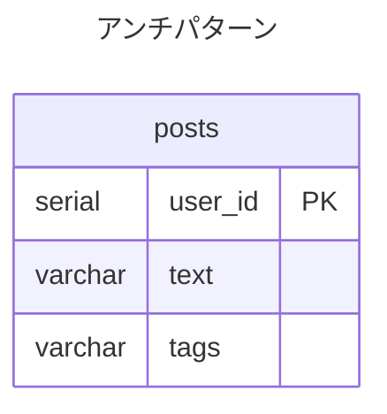
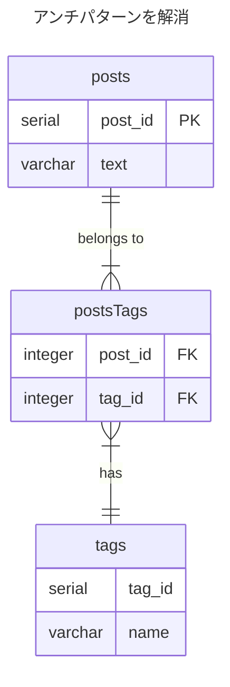

### 2-1

方針
- posts と tags 自体は n:m なので、交差テーブルで関係性を表現する

```mermaid
---
title: アンチパターン
---
erDiagram
    posts {
        serial user_id PK
        varchar text
        varchar tags
    }
```

```mermaid
---
title: アンチパターンを解消
---
erDiagram
    posts {
        serial post_id PK
        varchar text
    }
    postsTags {
        integer post_id FK
        integer tag_id FK
    }
    tags {
        serial tag_id
        varchar name
    }

    posts ||--|{ postsTags: "belongs to"
    postsTags }|--||tags: "has"
```
