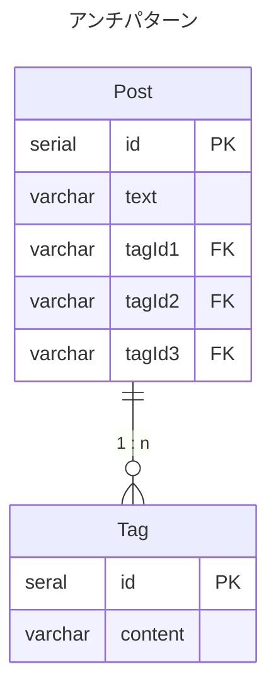
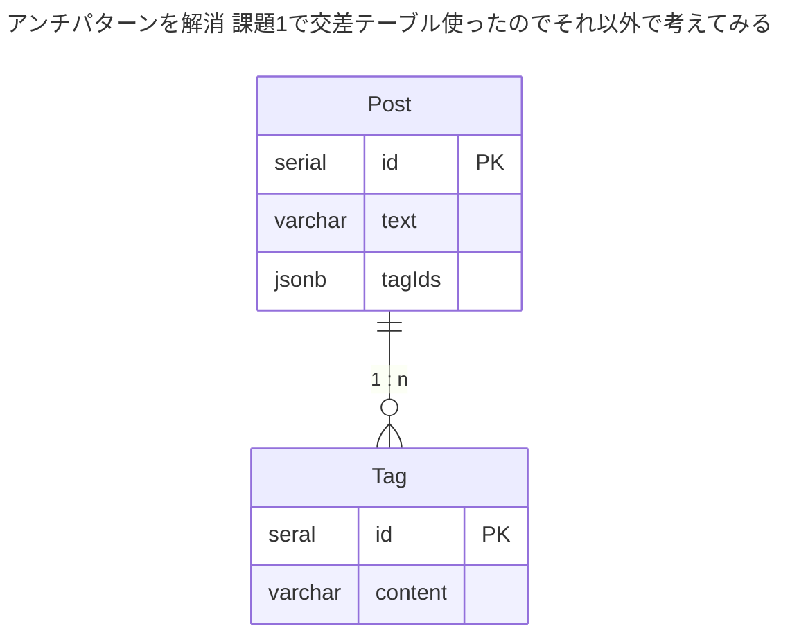

### 課題2

メモ
- jsonbを使うのは、結局RDBであることの意味を失わせている気はする
  - そもそも、正規化すれば実現できることをわざわざJSONB型を使うという選択はたぶんしない
  - これを使うことは課題1のアンチパターンにハマっているように思える
  - PostgreSQL前提だが、課題1のときにあげた問題のうちの一部は軽減できたり、発生させないということもできそう
  - とはいえ、これ使うんやったら、NoSQLのデータストアにしたらっていう気はしてくる
- JSONB型を使うメリット
  - インデックス効かせることができるらしい
  - JSON対応しているので、そのまま突っ込めて楽ではある
  - ref
    -  https://www.postgresql.jp/document/14/html/datatype-json.html
- JSONB型を使うデメリット
  - ORMが対応してないことがよくある
  - データの整合性保てない
    - どれを必須にする?しない？とかを決めなあかんけどあくまで1レコードの中のキーなので決めれない
