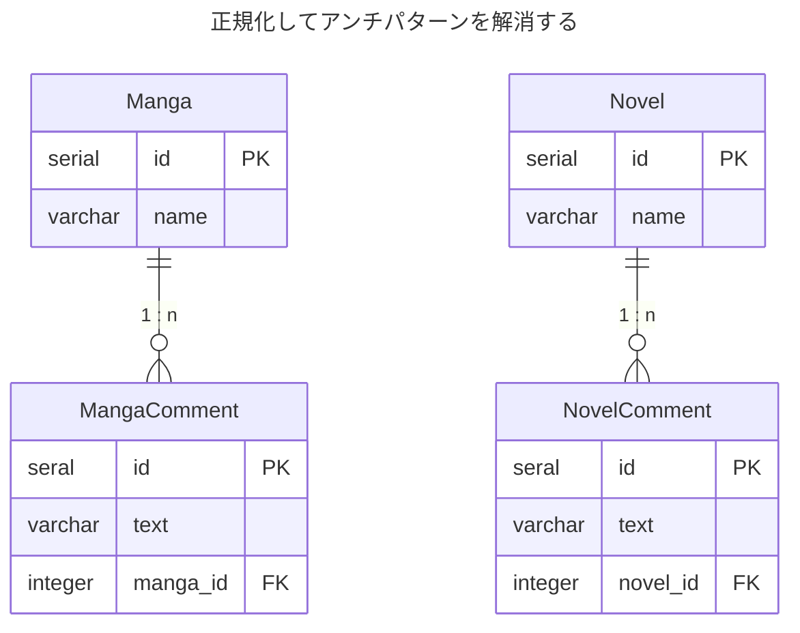

### 課題2

```mermaid
---
title: アンチパターン
---
erDiagram
    Manga {
        serial id PK
        varchar name
    }

    Novel {
        serial id PK
        varchar name
    }

    Comment {
        seral id PK
        varchar text
        belongs_to_id FK
        type
    }
    Manga ||--o{ Comment: "1 : n"
    Novel ||--o{ Comment: "1 : n"
```




メモ
- 方針として、書籍のカテゴリ(漫画、小説)ごとにテーブルをわけることにした。
- 書籍ごとにコメントテーブルの中身が大きく変わりそうではないので、Commentテーブルわけるかは一瞬悩んだ
  - 結局、Commentだけを串刺しでみたいということもない気がするし、書籍の種類ごとに何件コメントついてるかが最小のテーブルでわかるほうが嬉しいかということで今の形にした
