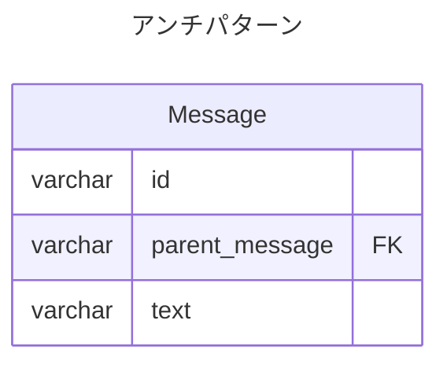
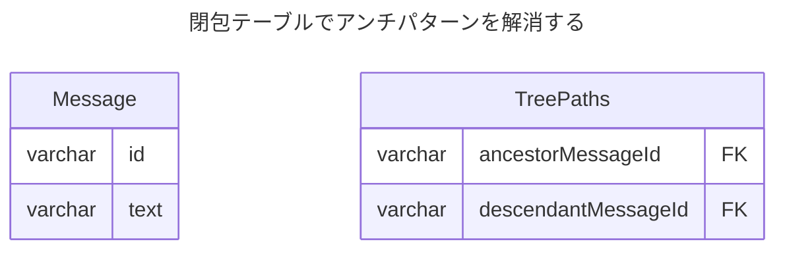

課題2-1

```mermaid
---
title: アンチパターン
---
erDiagram
    Message {
        varchar id
        varchar parent_message FK
        varchar text
    }
```

```mermaid
---
title: 閉包テーブルでアンチパターンを解消する
---
erDiagram
    Message {
        varchar id
        varchar text
    }

    TreePaths {
        varchar ancestorMessageId FK
        varchar descendantMessageId FK
    }
```
