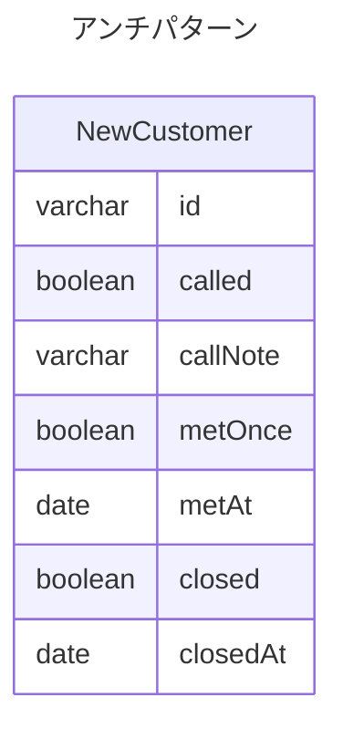
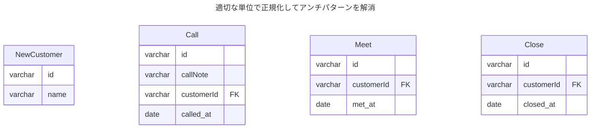

課題2-1

TABLE NewCustomer {
  id: varchar
  called: boolean -- 電話をかけたらTRUEになる。FALSEの人には電話をかけなければいけない
  callNote: varchar -- 電話をかけた時に交わした内容のメモ
  metOnce: boolean -- アポで面談したらTRUEになる
  metAt: date -- 面談をした日付が入る
  closed: boolean -- 成約した
  closedAt: date -- 成約した日付が入る
}

