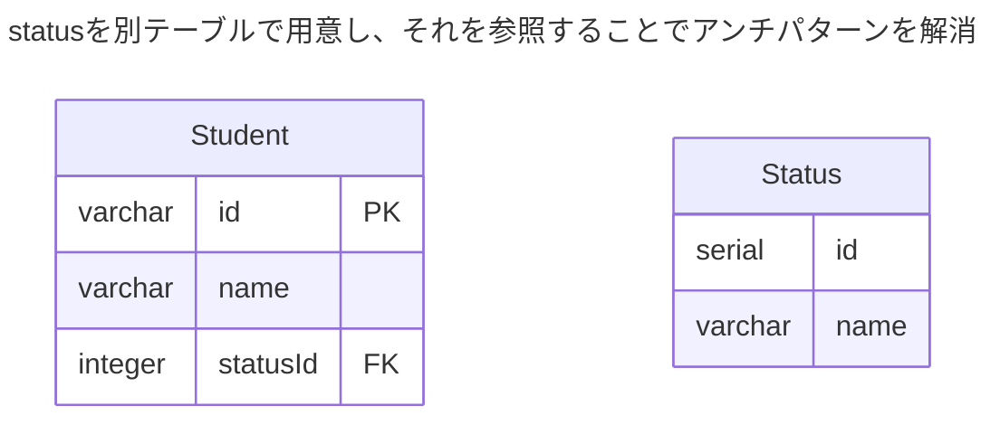

課題2-1
```mermaid
---
title: アンチパターン
---
erDiagram
    Student {
        varchar id PK
        varchar name
        varchar status  CHECK(status IN ("studying", "graduated", "suspended"))
    } 
```


