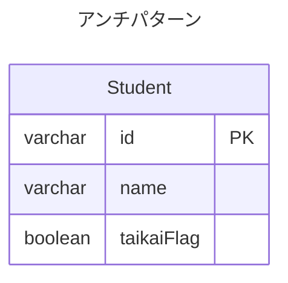
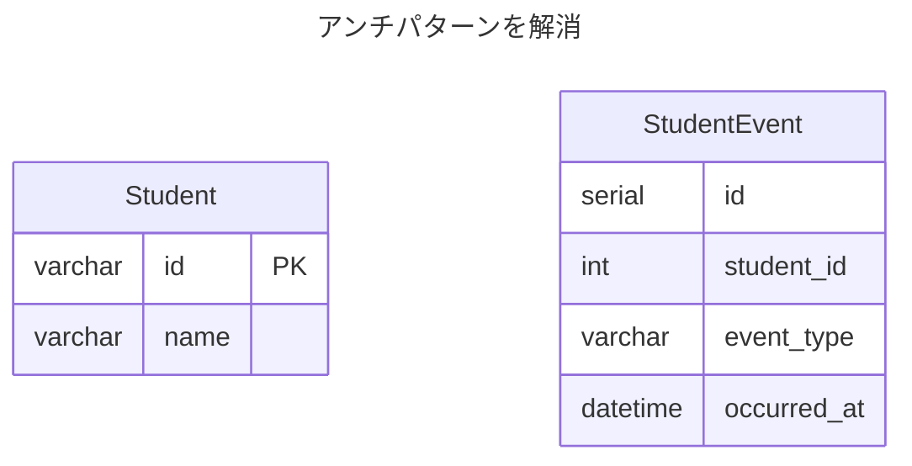

課題2-1

```mermaid
---
title: アンチパターン
---
erDiagram
    Student {
        varchar id PK
        varchar name
        boolean taikaiFlag
    } 
```

```mermaid
---
title: アンチパターンを解消
---
erDiagram
    Student {
        varchar id PK
        varchar name
    }
    
    StudentEvent {
        serial id
        int student_id
        varchar event_type
        datetime occurred_at
    }
```
event_typeにstudentに対するイベントを格納する
