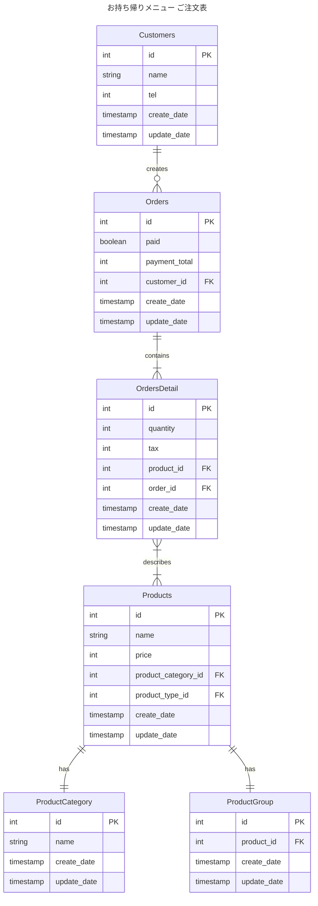
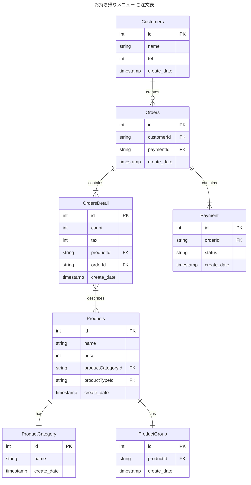

## 1-1
### ミュータブルデータモデリング

### イミュータブルデータモデリング

### メモ
- わさびの有無は別商品として扱う方針にしている
  - Productテーブルで別商品であることを明示して、ProductGroupで同じグループの商品であることを表現する
- もし、わさびつきを同じ商品として扱うなら、OrdersDetailsにカラム増やして、ProductGroupのテーブルを消すとかになる
  - メリット
    - 商品の仕様によって、OrderDetailsのカラムが増えないことで、過去データにNullがはいりうる可能性を排除できる
  - デメリット
    - カラム追加よりはテーブル追加になるので、ストレージサイズが増加してしまう

### 考えごと
- カラムで表現するのか、別テーブルで表現するのかが悩みどころ
- ミュータブルデータモデリングとイミュータブルデータモデリングの使い分け
