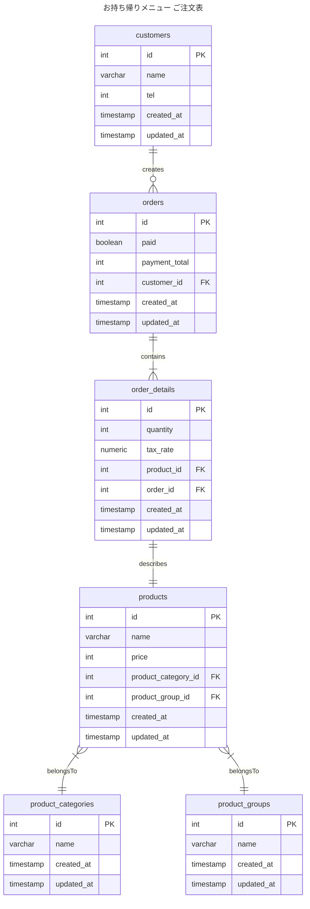
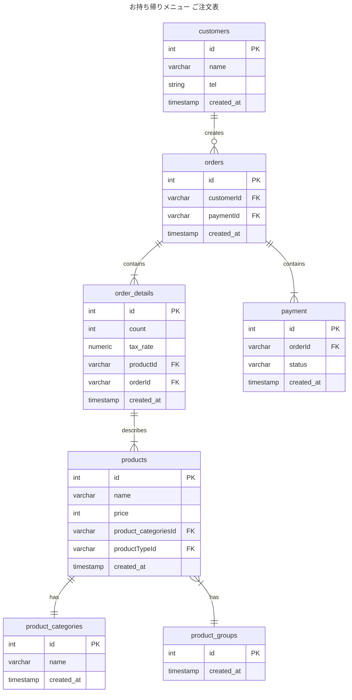

## 1-1

### 命名規則
- テーブル名、カラム名はスネークケースで表現する
- テーブル名は複数形にする

### 設計意図
- わさびの有無は別商品として扱う方針にしている
  - Productテーブルで別商品であることを明示して、product_groupで同じグループの商品であることを表現する
- もし、わさびつきを同じ商品として扱うなら、order_detailsにカラム増やして、product_groupのテーブルを消すとかになる
  - メリット
    - 商品の仕様によって、order_detailsのカラムが増えないことで、過去データにNullがはいりうる可能性を排除できる
  - デメリット
    - カラム追加よりはテーブル追加になるので、ストレージサイズが増加してしまう

### ミュータブルデータモデリング

### イミュータブルデータモデリング

