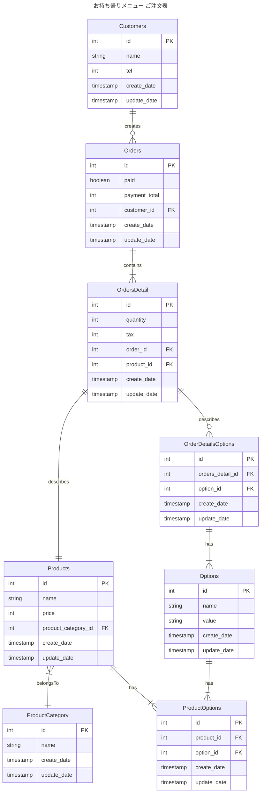

# 2-1

### 変更点
- ProductGroupテーブルの削除
- OrderDetailsごとにオプション（わさび有無、シャリサイズ大小）を指定するためにOrderDetailsOptionsテーブルで管理
- 商品ごとのオプションを紐づける中間テーブルでProductOptionsで管理する

### メモ
当初は、シャリのサイズに関してもわさびの有無と同様に別商品として扱うことで、テーブル変更は生じない想定だった。  
商品グループ（ProductGroup）テーブルでこれらが同じ商品グループに所属することを区別できれば良いという考えで、
Productテーブルに玉子でもわさびつきだったら、別商品として扱うようにしていた
- それぞれ、別のIDを持つ別商品として扱う。
  - たまご
  - たまご シャリ小
  - たまご シャリ大

わさびぬきで人気の商品なんだろうとかの検索を考えると、商品テーブルのnameであいまい検索しないといけなくなることで性能面で微妙そうだし、
運用担当者としても、商品管理が煩雑になるように思えたのでテーブル設計変更が必要と判断

