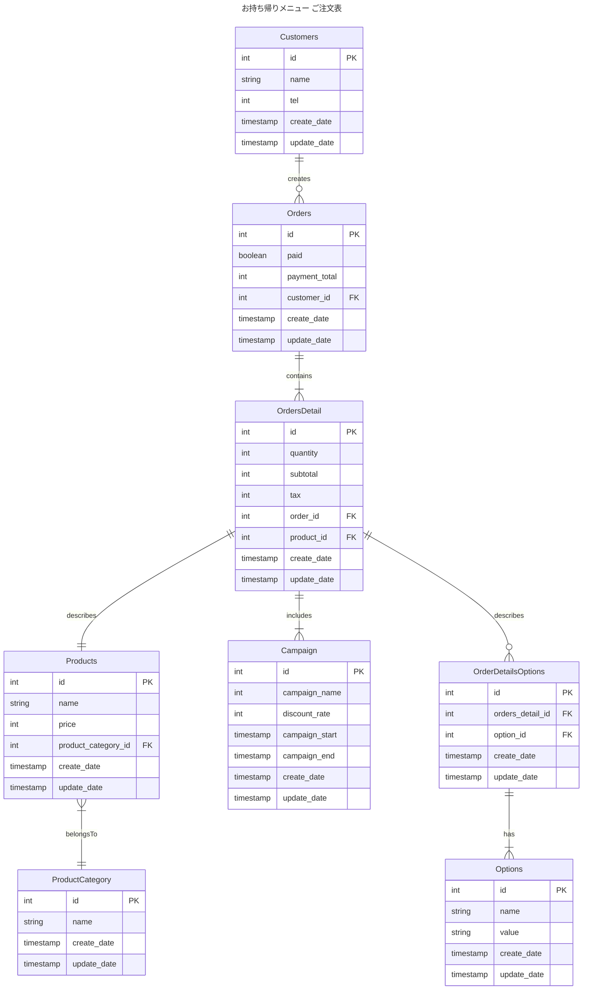

# 2-3

### 仕様追加
- 期間限定キャンペーン金額を設定できるようにする
  - 期間限定全品10%オフ

### 変更点
- OrderDetailsCampaignとCampaignテーブルを追加
- キャンペーン対象であればOrderDetailsの中間テーブルにキャンペーンIDと紐づけて保存される

```mermaid
---
title: お持ち帰りメニュー ご注文表
---
erDiagram
    Customers ||--o{ Orders : creates
    Customers {
        int id PK
        string name
        int tel
        timestamp create_date
        timestamp update_date
    }
    Orders ||--|{ OrdersDetail : contains
    Orders { 
        int id PK
        boolean paid
        int payment_total
        int customer_id FK
        timestamp create_date
        timestamp update_date
    }
    OrdersDetail ||--|| Products : describes
    OrdersDetail {
        int id PK
        int quantity
        int subtotal
        int tax
        int order_id FK
        int product_id FK
        timestamp create_date
        timestamp update_date
    }
    OrdersDetail ||--|{ Campaign : includes
    Campaign {
        int id PK
        int campaign_name
        int discount_rate
        timestamp campaign_start
        timestamp campaign_end
        timestamp create_date
        timestamp update_date
    }
    Products {
        int id PK
        string name
        int price
        int product_category_id FK
        timestamp create_date
        timestamp update_date 
    }
    Products }|--|| ProductCategory : belongsTo
    ProductCategory {
        int id PK
        string name
        timestamp create_date
        timestamp update_date
    }
    Options {
        int id PK
        string name
        string value
        timestamp create_date
        timestamp update_date
    }
    OrdersDetail ||--o{ OrderDetailsOptions: describes
    OrderDetailsOptions ||--|{ Options: has
    OrderDetailsOptions {
        int id PK
        int orders_detail_id FK
        int option_id FK
        timestamp create_date
        timestamp update_date
    }
```
