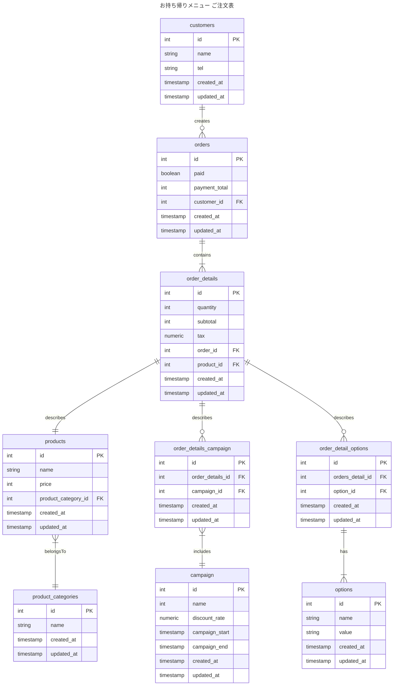

# 2-3

### 仕様追加
- 期間限定キャンペーン金額を設定できるようにする
  - 期間限定**全品**10%オフ

### 設計意図
- 全品に対する割引キャンペーン管理のためにorder_detailsに紐づけることにした
- 全品に対するキャンペーンであれば、Ordersに紐づけることも考えたが、個別商品やセットメニューに対するキャンペーンが必要になる可能性を踏まえ、order_detailsに紐づけ。
- キャンペーン対象であればorder_details_campaignの中間テーブルにキャンペーンIDと紐づけて保存される

### 変更点
- order_details_campaignとcampaignテーブルを追加

### ER図

