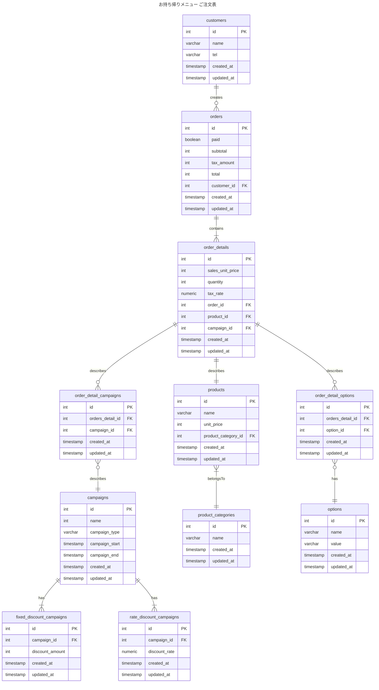

# 2-3

### 仕様追加
- 期間限定キャンペーン金額を設定できるようにする

### 設計意図
- 商品ごとにキャンペーン金額を指定することもできるが、運用するときの負担が大きいと判断し、期間限定で割引キャンペーン実施できるようにするという対応にしました。
  - 割引キャンペーンは 割引率または割引金額を指定する
- order_detailsテーブルに販売単価(sales_unit_price)とproductsテーブルの単価(unit_price)で区別できるようにする
- 全品に対する割引キャンペーン管理のためにorder_detailsに紐づける。
- 全品に対するキャンペーンであれば、Ordersに紐づけることも考えたが、個別商品やセットメニューに対するキャンペーンが必要になる可能性を踏まえ、order_detailsに紐づける

### 変更点
- campaignテーブル、fixed_discount_campaignsテーブル、rate_discount_campaignsテーブルを追加
- order_detailsテーブルに販売単価(sales_unit_price)カラム追加
- ordersテーブルに小計(subtotal)税額(tax_amount)カラム追加。合計金額(payment_total)のカラム名をtotalへ変更
- campaignsテーブルにfixed_discount_campaignsテーブルとrate_discount_campaignsテーブルを紐づけることで割引率のキャンペーンと割引額のキャンペーンを分割して管理できるようにする

### ER図

