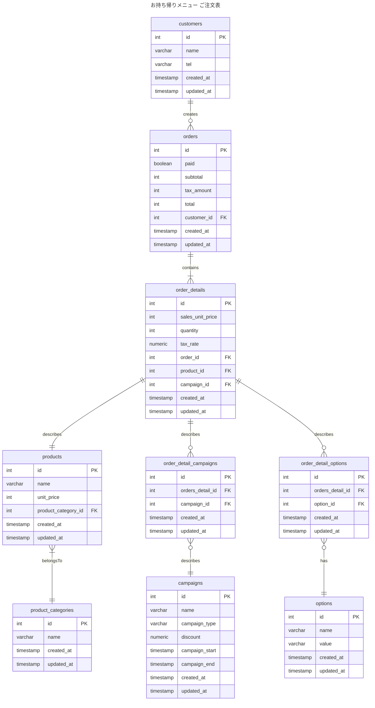

# 2-3

### 仕様追加
- 期間限定キャンペーン金額を設定できるようにする

### 設計意図
- 仕様から商品ごとにキャンペーン金額を指定することもできるが、運用するときの負担が大きいと判断し、期間限定で割引キャンペーン実施できるようにするという対応にしました。
  - 割引キャンペーンは期間限定で一律で一定額 or 一定割合で割引
  - 商品ごとに適用対象/非対象を設定
- order_detailsテーブルに販売単価(sales_unit_price)とproductsテーブルの単価(unit_price)で区別できるようにする
- 全品に対する割引キャンペーン管理のためにorder_detailsに紐づける。
  - 全品に対するキャンペーンであれば、ordersに紐づけることも検討したが、今回はorder_detailsに関連付けることにした
  - ordersに紐づけた場合は1注文単位で割引指定になる
  - キャンペーンの適用対象の判定はアプリケーション側で行う想定

### 変更点
- campaignテーブルを追加
- order_detailsテーブルに販売単価(sales_unit_price)カラム追加
- ordersテーブルに小計(subtotal)税額(tax_amount)カラム追加。合計金額(payment_total)のカラム名をtotalへ変更

### ER図

