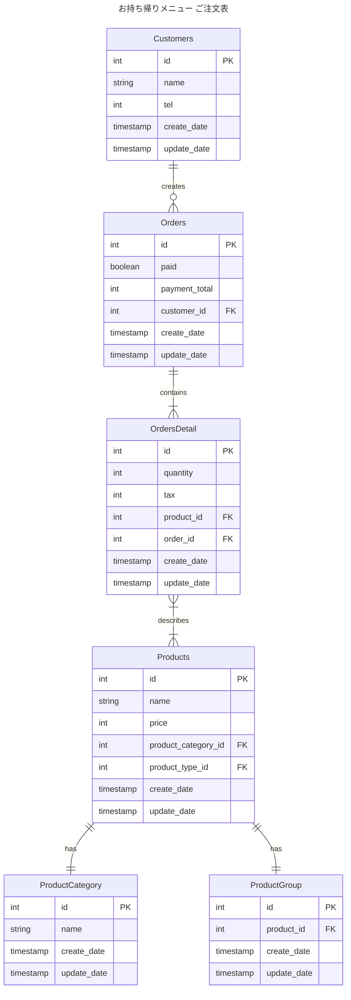

# 3-1
### ERD

### DDL
- 3-1/ddl.sqlを参照 
### DML
- 3-1/dml.sqlを参照 
### ユースケースを想定したクエリ
- 3-1/usecase.sqlを参照

### メモ
- ON DELETE SET NULL と ON DELETE SET CASCADE
  - 親子関係にあるデータのうち、親テーブルのデータが削除されたら、子テーブルの関連データがNullにするか、データを消すか？という違い
  - Nullを許容するかどうかで判断する必要がある
