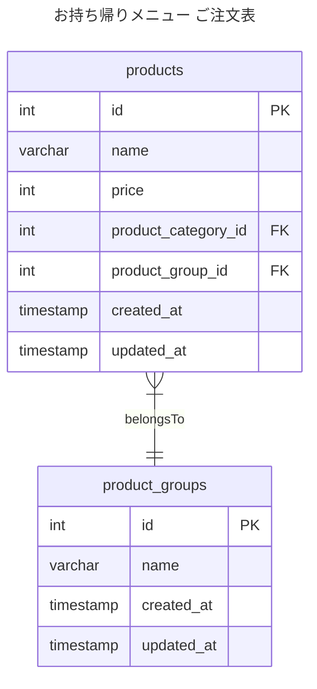
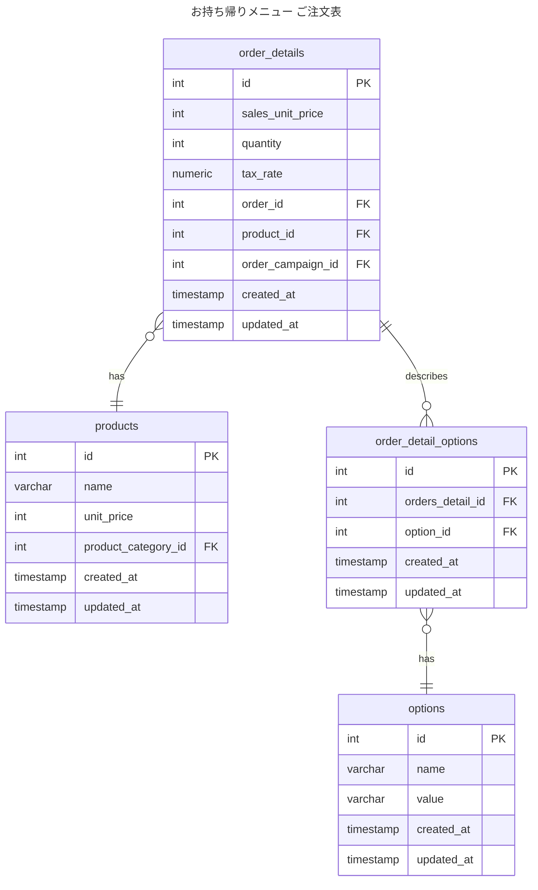

聞きたいことのまとめ

### コンタクト
- アキュビューオアシス
    - 1 day - 9000円
    - 2week - 6000円
    - 1month - 3000円
      → 各商品を別商品としてあつかって3商品つくる。商品の属性（価格、枚数など）が異なるので別商品として扱う。商品グループとしてアキュビューオアシスを作って管理する。そうすると、グループ単位でキャンペーンうったりできる。
        こっちは類似商品を別商品として扱いたいという場合に使ってる。グループで管理する必要がなければ、商品グループみたいなのもいらん

↓　すしの例だと微妙

### 寿司
- まぐろ 150円
    - しゃり小
    - しゃり普通
    - シャリ大
    - わさびあり
    - わさびぬき
      → 1商品＋オプションで扱う。オプションがあろうがなかろうが価格は変わらない。仮に組み合わせごとに商品を作ると、商品数が増えるため別商品として扱うのは避けたい。
        オプションつきでも同じ商品として扱う

追加
- わさびをどう扱うのか？今はオプションにしているが、カラムで表現することもできる
  - カラムで表現した場合
    - ◯ SQLがシンプルになる、JOINしたりが減る
    - △ 寿司以外のメニューもわさびありなしとかが入ることになる
  - 別テーブルで表現した場合は、商品の役割？が区別しやすいが、結合
    - ◯ 商品の役目がわかりやすいし、商品の拡張がしやすい。ラーメンにわさびなんかはいらないやろというような
    - △ JOINが増えるので、SQLは比較するとシンプルにはならない

- ユーザーがどう使いたいか
- 商品の管理者がどういうふうに登録、更新したいのか
- できないがあると
- これはオプションとして扱う
- 商品によるってなったときに
- ありとあらゆる
- どこまで抽象度上げるか構造として作るのか
  - 牛丼テーブルまで作るのか
- データ層でやるのか？アプリ層でやるのか？
- メニュー表をつくるのかからは考えてない
- モールつくるなら、
- 更新するときに、一貫性がないと、きついのと嘘があるときつい
- どう更新するか軸
- 具体度たかいところから抽象度あげてく
- にぎり→これだけやと、きつそうってなって、テーブル
- 握り、軍艦でオプションで同じオプションとするのか？
- 中間テーブルで差分金額を確認するパターンとか
  - ここで管理すると、
- 設定する側がらくとかもあるし、戻しやすいとかもある
- まきずしはシャリ小できないってなるという禁止ルールをつくるとしたらきついとかもある

履歴がいるなという 発送とかやったら、別になる

設計するとき

データが失われないかをまず考えないといけない
アプリケーションで複雑なことやるより、データベースでシンプルに実現できるならデータベースで対応してしまいたい
無限に考えることがあるけど、いろんな立場からみたときに対応しやすいかどうか
- ユーザーの目線
- 商品管理者の目線
- 売上管理者の目線　など

アプリケーションとしてどこまで対応するかの想定も大事
ただ、必ずしもすべての要望をシステムがわで担保しないといけないわけではないので、
まぐろだけシャリ小なしにしてとかしたいってなったとして、ホンマにたいおうしないといけないか？ とか考えていいおとしどころを見つける

具体で考えて徐々に抽象度上げることで考えやすそうってなったこと

テーブルわけるきっかけ
- 一旦、牛丼テーブルまで作るで考えてみて、じゃあ味噌汁ふやすとしたらどうするとかって考えたら、
- 商品数のぶんだけテーブル増えて扱いづらいかもって思ったら、分割しすぎかもって考えて抽象度をあげてメニューとして扱うとか

カラムにいれたままにするか、テーブルわけるか考えるきっかけ
- 具体的にデータ入れたとして考えてみる
  - わさびがカラムにあったとして、巻きずしにわさびはないかとかで違和感になったらテーブル分けたほうが良いかもと考えるきっかけになる

データが失われないか
- 去年は130円でサーモンうってました。今年は150円です。
  - 売上集計するときに、去年の値段が変わってたら、分析つらいし、そこからの計画も立てづらい
- 発送先
  - ユーザーの配送先指定で2月まで大阪に住んでたけど、9月からは東京に引っ越してた
  - 発送履歴見たときに、ひっこしたからって2月に東京に発送してたことになってたりしたら辛い
どっちも履歴ほしいが、履歴の管理の仕方はかわりそう