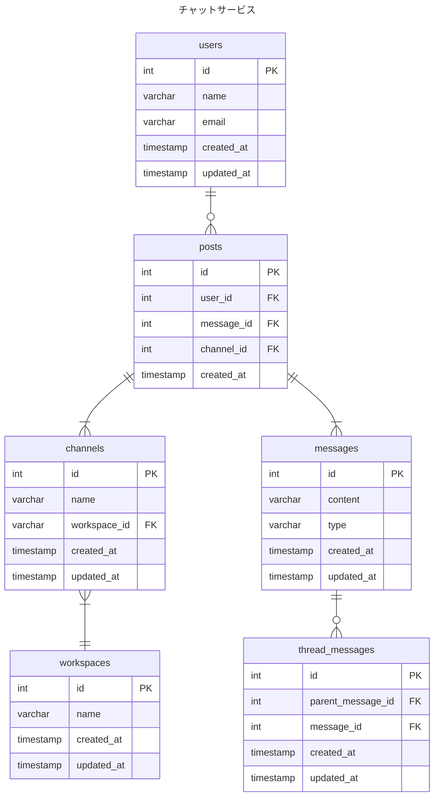

### アンチパターンと初回のDB設計で微妙だったところを見直し

- そもそも履歴管理したいもんでもないので更新前提で設計し直す
  - すべてのテーブルにidが2つあっていびつな形になっていたのを修正
- スレッドメッセージの順序管理を整数値でやっていたが、その場合すべてのレコードを変える必要があるが、timestampで順序管理は可能なのでカラム自体削除した

### ERD

```mermaid
---
title: チャットサービス
---
erDiagram
  %% ユーザー(R)
  users {
    int id PK
    varchar name
    varchar email
    timestamp created_at
    timestamp updated_at
  }
  %% ワークスペース(R)
  workspaces {
    int id PK
    varchar name
    timestamp created_at
    timestamp updated_at 
  }
  %% チャンネル(R)
  channels { 
    int id PK
    varchar name
    varchar workspace_id FK
    timestamp created_at
    timestamp updated_at
  }
  %% 投稿(E)
  posts {
    int id PK
    int user_id FK
    int message_id FK
    int channel_id FK
    timestamp created_at
  }
  %% メッセージ(R)
  messages {
    int id PK
    varchar content
    varchar type
    timestamp created_at
    timestamp updated_at
  }
  %% スレッドメッセージ(R)
  thread_messages {
    int id PK
    int parent_message_id FK
    int message_id FK
    timestamp created_at
    timestamp updated_at
  }
  channels }| -- || workspaces: ""
  users ||--o{ posts: ""
  posts ||--|{ channels: ""
  posts ||--|{ messages: ""
  messages ||--o{ thread_messages: ""
```
