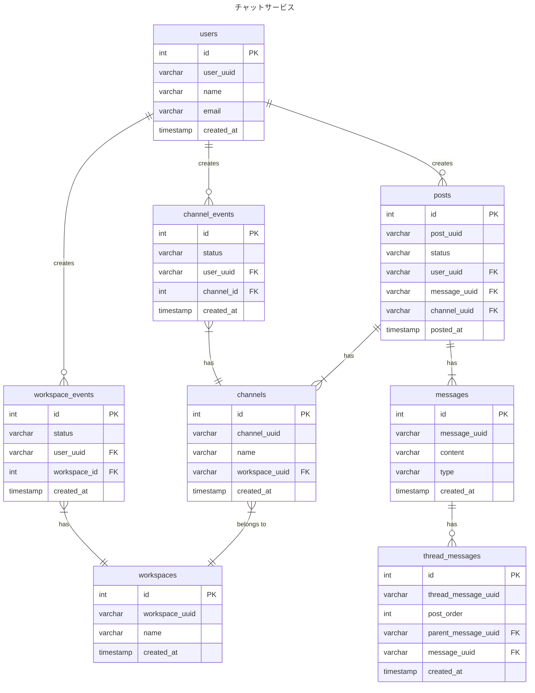

### アンチパターンと初回のDB設計で微妙だったところを見直し

- 無駄にidが多くなっているのでidの採番を見直す
- Fractional Indexingとかつかって順番管理ちゃんとできるようにする
- statusフラグどうにかなりませんか？

### ERD

```mermaid
---
title: チャットサービス
---
erDiagram
  %% ユーザー(R)
  users {
    int id PK
    varchar user_uuid
    varchar name
    varchar email
    timestamp created_at
  }
  %% ワークスペース(R) 
  workspaces {
    int id PK
    varchar workspace_uuid
    varchar name
    timestamp created_at
  }
  %% チャンネル(R)
  channels {
    int id PK
    varchar channel_uuid
    varchar name
    varchar workspace_uuid FK
    timestamp created_at
  }
  %% ワークスペースイベント(E)
  workspace_events {
    int id PK
    varchar status
    varchar user_uuid FK
    int workspace_id FK
    timestamp created_at
  }
  %% チャンネルイベント(E)
  channel_events {
    int id PK
    varchar status
    varchar user_uuid FK
    int channel_id FK
    timestamp created_at
  }
  %% 投稿(E)
  posts {
    int id PK
    varchar post_uuid
    varchar status
    varchar user_uuid FK
    varchar message_uuid FK
    varchar channel_uuid FK
    timestamp posted_at
  }
  %% メッセージ(R)
  messages {
    int id PK
    varchar message_uuid
    varchar content
    varchar type
    timestamp created_at
  }
  %% スレッドメッセージ(R)
  thread_messages {
    int id PK
    varchar thread_message_uuid
    int post_order
    varchar parent_message_uuid FK
    varchar message_uuid FK
    timestamp created_at
  }
        
  users ||--o{ workspace_events: "creates"
  users ||--o{ channel_events: "creates"
  users ||--o{ posts: "creates"
  channels }| -- || workspaces: "belongs to"
  posts ||--|{ channels: "has"
  posts ||--|{ messages: "has"
  messages ||--o{ thread_messages: "has"
  workspace_events }|--|| workspaces: "has"
  channel_events }|--|| channels: "has"
```
