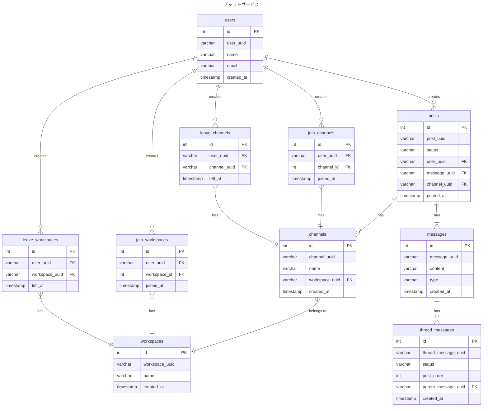

# 2-1

### 設計意図
- トランザクションや履歴管理を別テーブル用意したくないので今回は、イミュータブルデータモデリングで設計しました。
- UPDATE が発生させないことによるデータ量の増加は許容する方針です。
- messageとthread_messageについて
  - messagesテーブルのtypeカラムで「message」か「thread_message」という値で投稿したメッセージの種別を管理します。
  - thread_messagesテーブルのparent_message_idでどのメッセージに紐づくスレッドメッセージかを判断して、statusによって表示する方針です。スレッドメッセージがあとから編集されたときに順序を保つために、post_orderのカラムを使います。
- usersテーブルには本来パスワードなどのカラムが必要ですが、今回のテーブル設計では認証周りの要件は外しました。

### Event と Resource の整理について
- Event は動詞で表現できるもの。〜する、〜日で表現して違和感のないものがEvent系と判断
- Resource は名詞で表現できるもの。Event系のように〜日で表現できないものをResource系と判断
- mermaidで表現したERDのコメントとしてテーブル名(E/R)を追加
  - E: Entity
  - R: Resource
- 「事実を記録」するという方針でEventを分けています。チャンネルの参加とワークスペースの参加は異なるEventのため別々に記録。退出を参加と同じテーブルで管理しようとしたが、参加日と退出日というカラムが必要になるため、別々のテーブルで管理する方針にした。
  - ただし、チャンネルの参加と退出などの管理をするテーブルとして、参加/退出をstatusとして管理すれば、１テーブルで良いはずとも考えました。なので、今よりよい設計がありそうかなとは思ってます。
  - この案を採用しなかったのは、「チャンネル所属管理」みたいな目的が人によって変わる名前しか思いつかなかったため。

### ERD

### 微妙と思ってること
- スレッドメッセージの順序をどう管理するのがベストか？
  - 今の設計だと、投稿時にparent_message_idに紐づくスレッドメッセージの件数をカウントしてから、Insertしないと順序が保てないのが気になる
- チャンネルとワークスペースの参加/退出テーブルが別々なこと
  - 1テーブルで管理していれば、最後のレコードのstatusだけみれば状態がわかるからそのほうが楽だとは思う。

#### 参考
- [イミュータブルデータモデル](https://scrapbox.io/kawasima/%E3%82%A4%E3%83%9F%E3%83%A5%E3%83%BC%E3%82%BF%E3%83%96%E3%83%AB%E3%83%87%E3%83%BC%E3%82%BF%E3%83%A2%E3%83%87%E3%83%AB)
- [DB設計のアプローチ：マスタ・トランザクション vs イミュータブルデータモデル](https://qiita.com/tonbi_attack/items/59439398a4899506de0e)