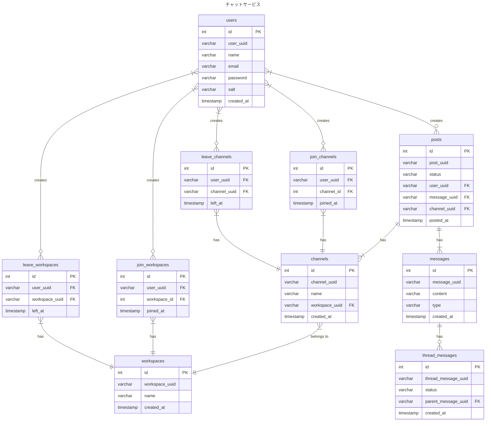

# 2-1

### 設計意図
- トランザクションや履歴管理を別テーブル用意したくないので今回は、イミュータブルデータモデリングで設計しました
- 事実を記録する
- UPDATE が発生しないことによるデータ量の増加は許容する方針

### Event と Resource の整理

- Event は動詞で表現できるもの。〜する、〜日で表現して違和感のないものがEvent系と判断
- Resource は名詞で表現できるもの。Event系のように〜日で表現できないものをResource系と判断

#### Event 
- 参加,脱退
  - ユーザーがワークスペースに参加する, 脱退する
  - ユーザーがチャンネルに参加する, 脱退する
- 投稿
  - ユーザーがチャンネルにメッセージを投稿する, 編集する, 削除する
  - ユーザーがチャンネルのメッセージにスレッドメッセージを投稿する, 編集する, 削除する
- 検索

#### Resource
- ユーザー
- ワークスペース
- チャンネル
- メッセージ
- スレッドメッセージ

### ERD

### メモ

- あるメッセージが更新されたら、それに紐づくスレッドメッセージもつけかえが必要になる
- つまりPKだけで管理するとややこしいなになりそう
- メッセージとスレッドメッセージの話は以前あったセットメニューの扱いとか、注文に対する明細の扱いが近い
- 参考
  - https://scrapbox.io/kawasima/%E3%82%A4%E3%83%9F%E3%83%A5%E3%83%BC%E3%82%BF%E3%83%96%E3%83%AB%E3%83%87%E3%83%BC%E3%82%BF%E3%83%A2%E3%83%87%E3%83%AB
  - https://qiita.com/tonbi_attack/items/59439398a4899506de0e
