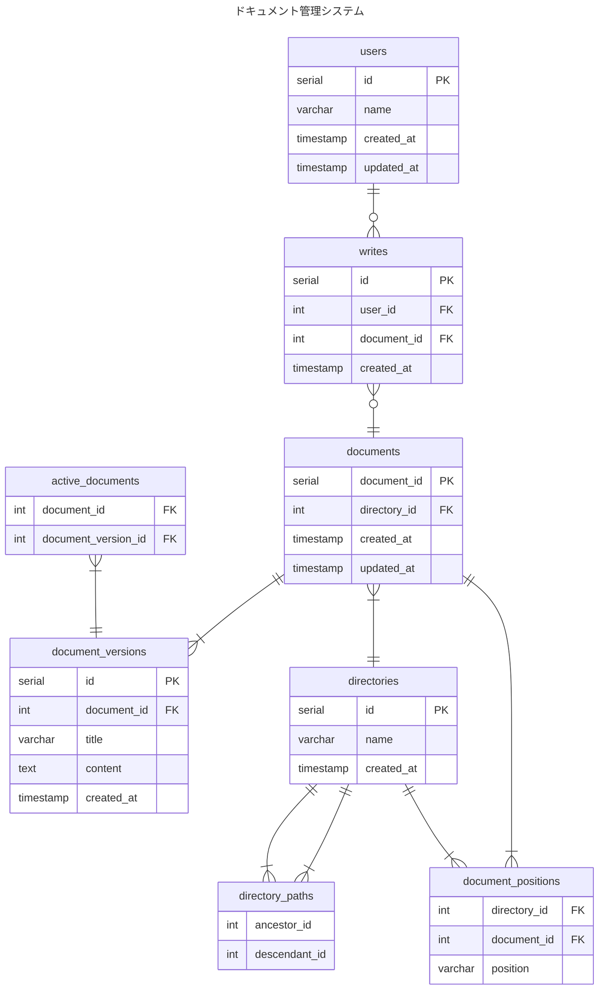

### アンチパターンと初回のDB設計で微妙だったところを見直し

- usersテーブルは課題の主となるテーブルではないので最低限のものとする
- writesが依存するのはusersとdocumentsだけにさせた。当初はdirectoriesも入れてたが、documentsテーブルでdirectoryの情報をもつようにした
- ドキュメントの履歴管理には世代バージョンタグ付けパターンで表現し直す
  - すべてのバージョンをデータとして持っておいて、ポインタ/タグでどれをアクティブなものとするかをきめるパターン
- ディレクトリの構造管理は閉包テーブルで表現する
  - ancestor_idとdescendant_idには自身を含んですべての親子関係を保持させる
- ディレクトリ内の順番管理にはFractional Indexingをつかって管理する
  - document_positionsテーブルのpositionを文字列として扱い順番を入れ替えたいところだけを触れば成立させる

