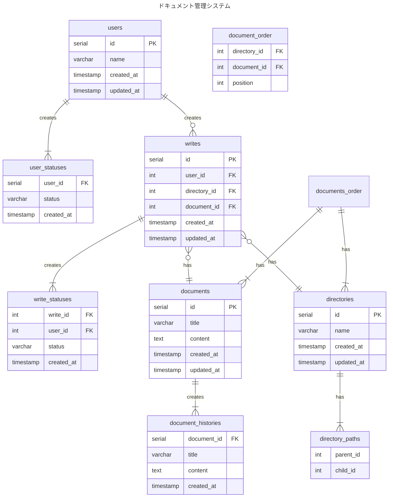

# 3-2

### 設計方針

- ディレクトリ内のドキュメントの並び順を管理するテーブルを1つ作成して対応する
    - このテーブルでは、どのディレクトリになんのドキュメントがどういう順番で入っているのかを示す
    - priorityで順番管理。数値を連番でいれる。

### 微妙と思ってること

- ディレクトリ内のドキュメントの順番管理が納得感ある設計に至らなかった
    - 順番管理用のテーブルを作ったが、ドキュメント100個あって、3番目に追加したいってなったら後ろの97個を更新対象になるのが、なんか微妙な気はしていた
    - かといって、代案も浮かばないので、一旦は今の設計に落ち着いた    

### ERD

### 参考
- [階層構造(a.k.a ツリー構造・ディレクトリ構造・フォルダ)をDBでどう設計すべきか](https://teitei-tk.hatenablog.com/entry/2020/11/30/130000)
- [階層構造データへの挑戦](https://qiita.com/uchinami_shoichi/items/5fa52f340003107d46c1)
- [表示順という属性を別テーブルに分ける](https://soudai.hatenablog.com/entry/2022/01/27/114257)
- [並べ替えできるデータをデータベースに保存する方法](https://zenn.dev/itte/articles/e97002637cd3a6)
