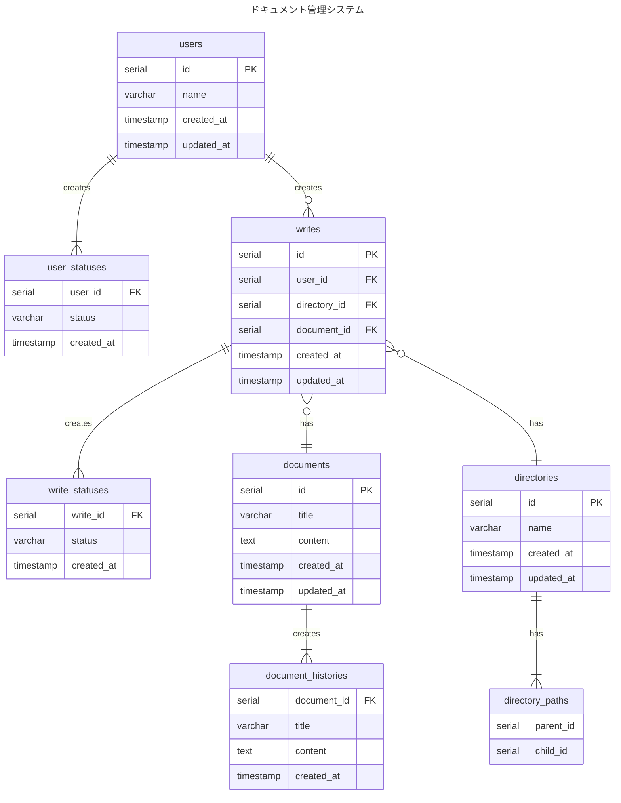

# 3-1

### 設計意図
- マスタ・トランザクション で設計
- 履歴管理はRDBの責務として、RDBで対応する
    - ユーザーおよび執筆の履歴管理に関しては、それぞれのテーブルの statusテーブルを別途作成し、その最新のレコードで状態を判定させる
    - ドキュメント自体の履歴管理はstatusではなく、document_historiesテーブルの作成日時に基づいて管理
- 課題に明記されていない想定仕様
    - ユーザーが削除されても、ドキュメントは削除はされない
    - ディレクトリを削除した場合、その中にあるドキュメントも削除する

### Event と Resource の整理

- Event
    - 執筆

- Resource
    - ユーザー
    - ドキュメント
    - ドキュメント履歴
    - ディレクトリ
    - ディレクトリパス
    - ユーザー状態
    - 執筆状態

### ERD

### 微妙と思ってること

- 

### 参考
- [階層構造(a.k.a ツリー構造・ディレクトリ構造・フォルダ)をDBでどう設計すべきか](https://teitei-tk.hatenablog.com/entry/2020/11/30/130000)
- [階層構造データへの挑戦](https://qiita.com/uchinami_shoichi/items/5fa52f340003107d46c1)
