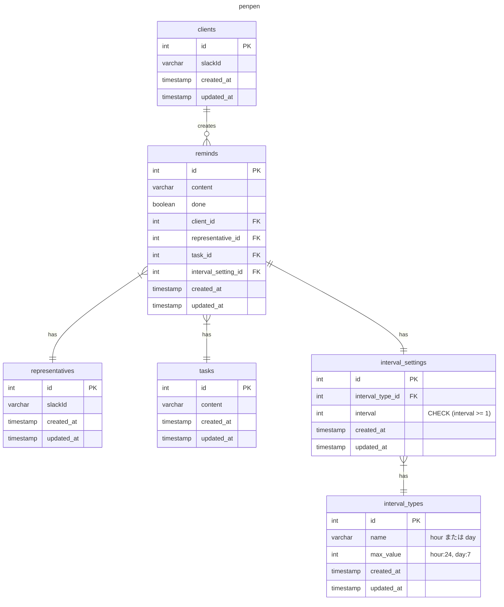

### アンチパターンと初回のDB設計で微妙だったところを見直し

- idの採番を見直す。clientsとrecepintsいる？とか
- doneフラグ
- interval types はEAV
- 

```mermaid
---
title: penpen
---
erDiagram
  %% 依頼者(R)
  clients {
    int id PK
    varchar slackId
    timestamp created_at
    timestamp updated_at
  }
  %% リマインド (E)
  reminds {
    int id PK
    varchar content
    boolean done
    int client_id FK
    int representative_id FK
    int task_id FK
    int interval_setting_id FK
    timestamp created_at
    timestamp updated_at
  }
  %% 担当者(R)
  representatives {
    int id PK
    varchar slackId
    timestamp created_at
    timestamp updated_at
  }
  %% タスク(R)
  tasks {
    int id PK
    varchar content
    timestamp created_at
    timestamp updated_at
  }
  %% リマインド間隔タイプ(R)
  interval_types {
    int id PK
    varchar name "hour または day"
    int max_value "hour:24, day:7"
    timestamp created_at
    timestamp updated_at
  }
  %% リマインド間隔設定(R)
  interval_settings {
    int id PK
    int interval_type_id FK
    int interval "CHECK (interval >= 1)"
    timestamp created_at
    timestamp updated_at
  }
  
  clients ||--o{ reminds: "creates"
  reminds }|--|| representatives: "has"
  reminds }|--|| tasks: "has"
  reminds ||--|| interval_settings: "has"
  interval_settings }|--|| interval_types: "has"
```