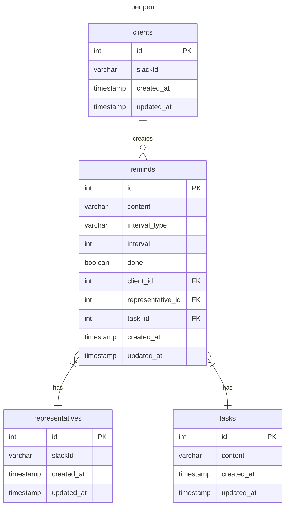

### 仕様整理
- https://qiita.com/dowanna6/items/b5d1d0245985a26abf8e
- https://penpen.netlify.app/

penpenするユーザーはタスクをどんな間隔でリマインドするかを決める
penpenされるユーザーは誰からなんのタスク依頼がきたのかが通知される
penpenされるユーザーはタスクの完了をマークできる
penpenするユーザーは自分に対しても、penpenすることができる

/penpen 自分がだれかにタスクを依頼する
/penpen-outgoing 自分が設定したタスク一覧を表示
/penpen-list 自分宛てのタスク一覧を表示する

### 設計意図
- 履歴を取りたいようなデータもないと判断し、ミュータブルな形でデータモデリングする
- ユーザーの管理はSlack側が担うので、データベースとしてユーザーを管理することはないものとする
  - https://api.slack.com/methods/users.info
- タスクの通知間隔は hours / days で最小間隔で1hour最大間隔で7daysの仕様とする

### ERD

### 微妙と思ってること
- interval_type には day / hour が入りうるが、どのようにして入れ間違いを防ぐのか
- 25hoursにしたりするのをどう防ぐか?
- 8daysにしたのをどう防ぐか
- 0を入れないという対応

### 参考
- 