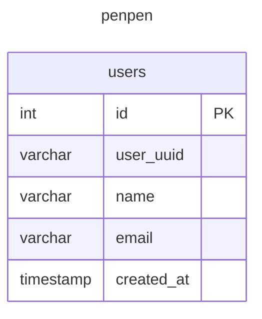

### 仕様整理
- https://qiita.com/dowanna6/items/b5d1d0245985a26abf8e
- https://penpen.netlify.app/

### 設計意図

### Event Resource

Event 
- 

Resource
- 

### ERD

```mermaid
---
title: penpen
---
erDiagram
  %% ユーザー(R)
  users {
    int id PK
    varchar user_uuid
    varchar name
    varchar email
    timestamp created_at
  }
```

### 微妙と思ってること

### 参考
- 