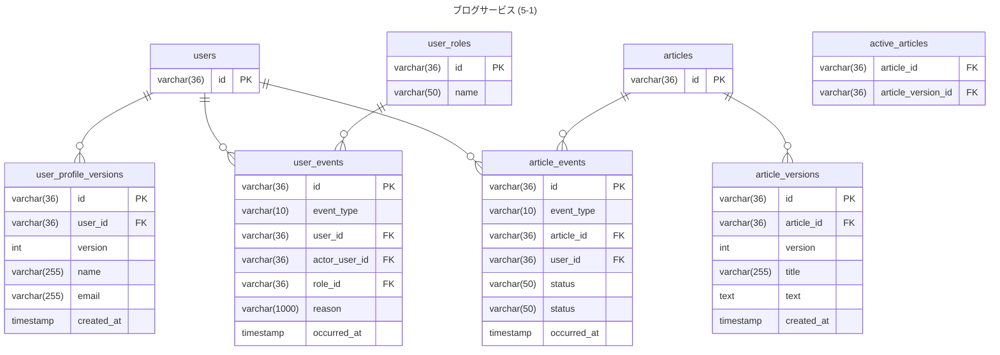
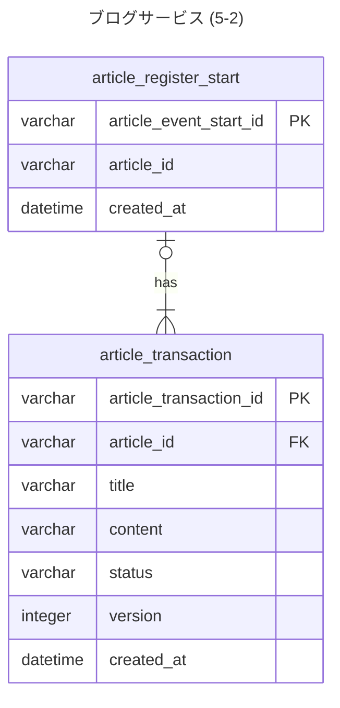

### アンチパターンと初回のDB設計で微妙だったところを見直し

変更点
- event_typeテーブルの削除
- 世代バージョンタグ付けパターンでどのバージョンに戻したかをおえるようにする

変更点
- resultテーブル不要なので削除した。
　- resultテーブルは外部にAPI叩いた結果をもとに判定するなどであれば必要だが、今回は自身のアプリケーションに閉じるため不要
- トランザクション管理しない理由
  - どちらも登録できてたら問題なし。article_register_startで失敗したら、最初からやり直し。
article_transactionに失敗したら、article_startの登録だけなので記事の内容自体がないので使えない。

