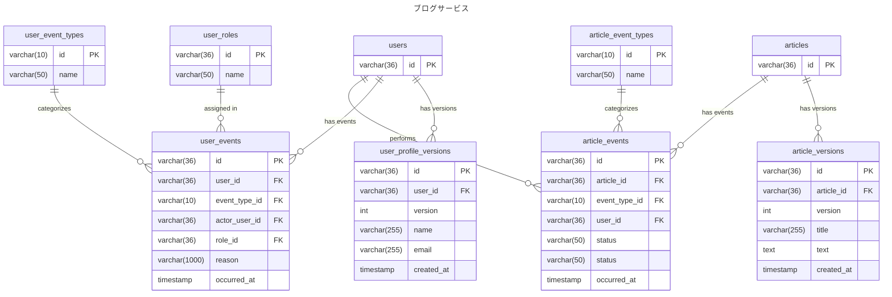

# 5-1

## 設計意図
- テーブルの増加を重く捉えずに、責務ごとにテーブルを分ける方針
- ResourceとEventに分けて設計する
- 完全にUPDATEのSQLが発生しないテーブル設計にする
- Event ごとにテーブルをわけるという設計を実行したが、クエリがものすごく複雑になった。
  - INSERTする分には問題ないがクエリ書こうとするときの負荷が高くEventだけはまとめることにした。
- EventTypeをテーブル分けて表現してみた。とりあえずテーブル見たらどういうeventがあるかがわかるようにするため
  - ただし、アプリケーション側で値を管理して、送信すればテーブルevent_typeのテーブルを消せるよなと思ったり
  - アプリケーション側のソースコードを追わないと、event_typeがわからないのとどっちを取るかによって判断変わりそうとは思った。

### ER図

