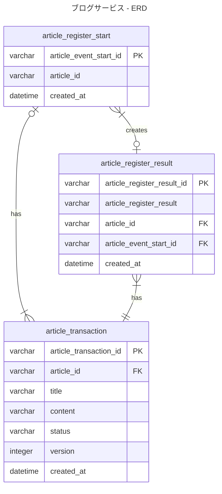

### 5-1で設計したのと違う形でUML作成

設計意図
- 少なめのテーブルで表現してみる
- userもresourceとしているが、この課題においては無視します。登録=公開という前提にしてみます。
- テーブルの役目
    - article_register_start 
        - 記事のID採番と記事の登録が開始したというイベントを記録する
    - article_transaction
        - 記事の内容をすべて保存していくテーブル
    - article_register_result
        - article_transactionが正常に登録できたかによって、記録される内容を変える
        - article_transactionへの登録が成功したなら、resultには成功、失敗したならresultに成功を入れる
- 記事を作成するときの流れ
  - DB側でトランザクション管理もしない。FKにより前の処理が失敗したら、すべて失敗するため
  - article_register_startへINSERT
  - article_transactionへINSERT
    - statusで CREATED / UPDATED / DELETED などを入れる予定
  - article_register_resultへINSERT
    - 実行前にarticle_register_startとarticle_transactionをJOINした結果をSELECTもしくはINSERT後に成功してたらarticle_idをreturnするみたいにしてから、article_register_resultを記録する
- 作成した記事の履歴を取得するとき
    - 特定記事に対する失敗イベントが記録されているかチェック
    - なければ、article_transactionをみて、article_idで絞り込む
    - あれば、3つのテーブルJOINして失敗以外を排除して絞り込み
- article_register_eventsに失敗するのは、トランザクションの記録に失敗したときのみになる想定

