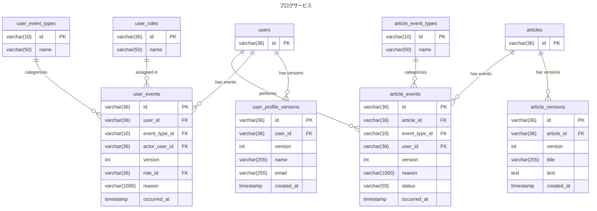

# 5-1

## 設計意図
- テーブルの増加を重く捉えずに、責務ごとにテーブルを分ける方針
- ResourceとEventに分けて設計する
- 完全にUPDATEのSQLが発生しないテーブル設計にする
- Event ごとにテーブルをわけるという設計を実行したが、クエリがものすごく複雑になった。
  - INSERTする分には問題ないがクエリ書こうとするときの負荷が高くEventだけはまとめることにした。

## 仕様
### ユーザー
- ユーザーはユーザー情報を自由に変更できる
- ユーザーにはロールがあり、一般ユーザーと管理者ユーザーを持つ。
- 一般ユーザーは、「入会」「退会」イベント、管理者ユーザーも「入会」「退会」イベントと一般ユーザーに対する「強制退会」イベントを実行できる 
- ユーザーは複数のロールを割り当てることができる。

### 記事
- 記事の種別として、ドラフト記事と公開記事を持つ
- ドラフト記事に対するイベントとしては「ドラフト作成」「ドラフト削除」
- 公開記事に対するイベントとしては「記事公開」「記事非公開」「記事削除」がある
- 公開記事を公開後に編集する場合は、ドラフト記事を作成し、新たなバージョンの記事は記事公開イベントを通して、公開される

### ER図

