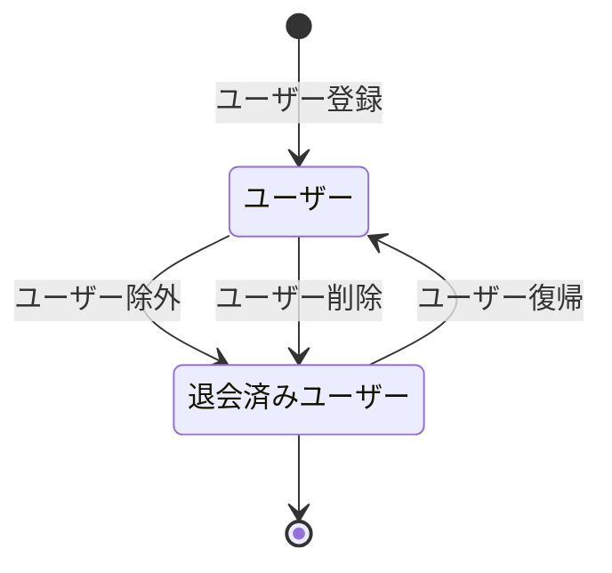
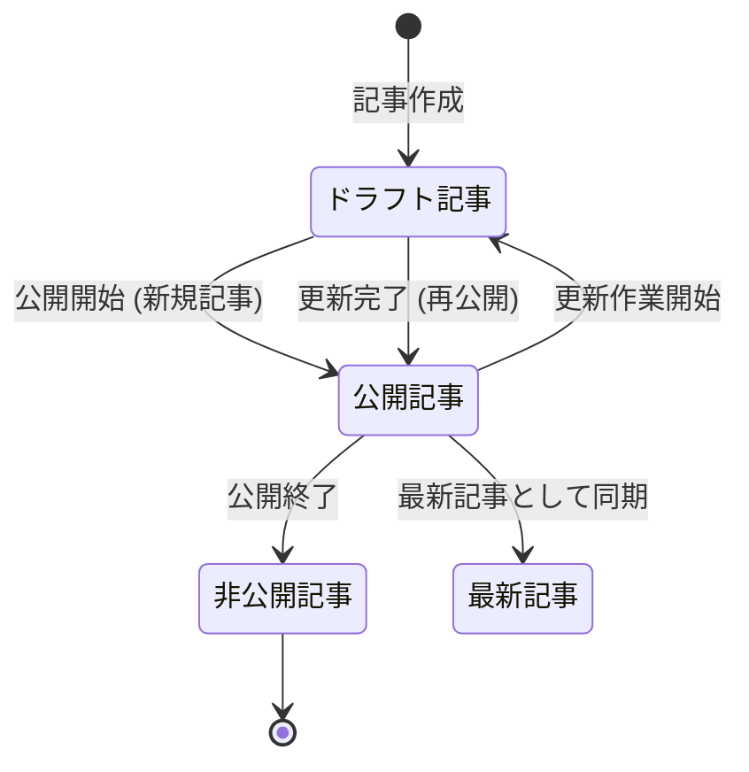
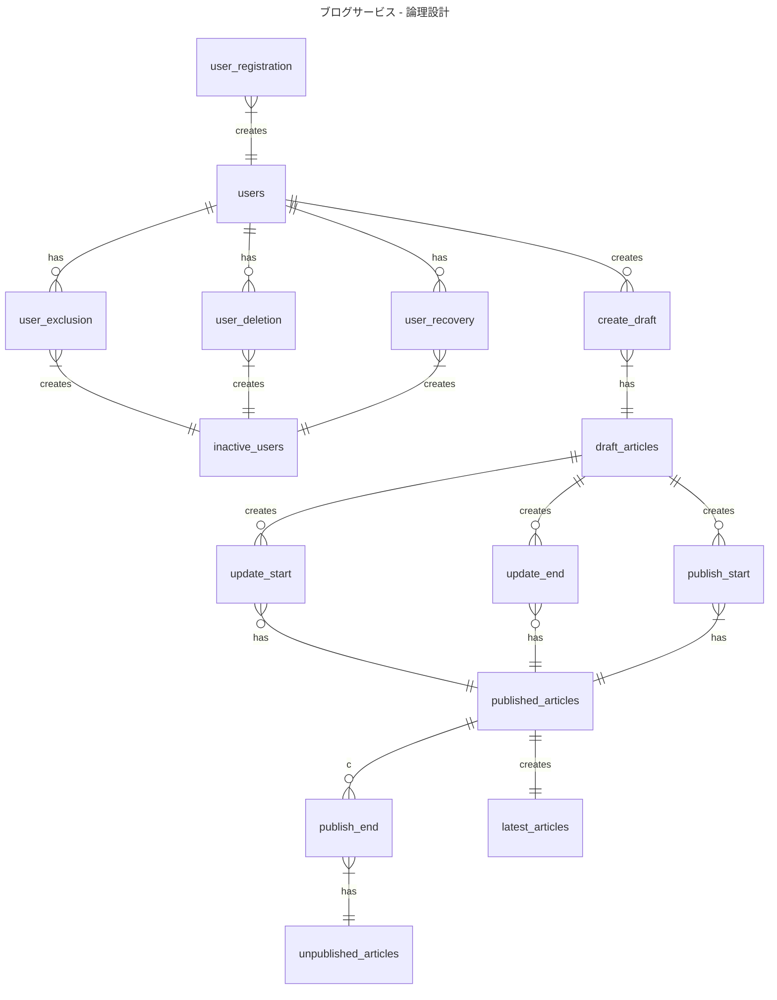
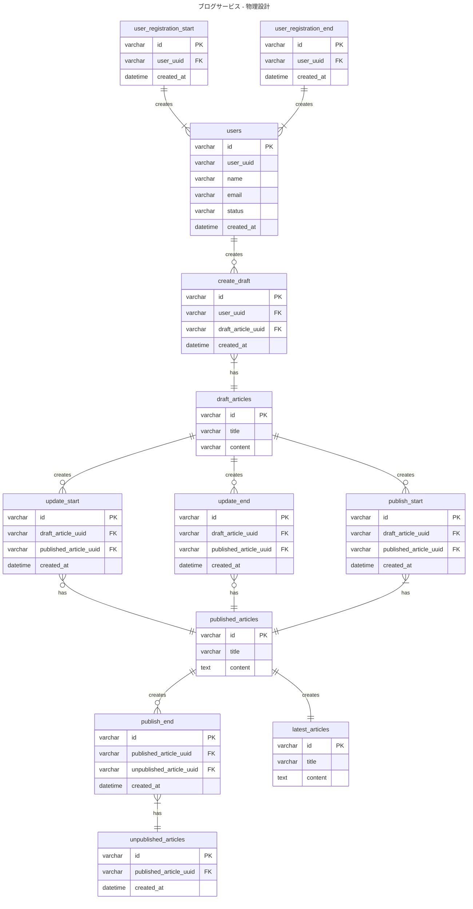

# 5-1

### 仕様整理

### ユーザーの状態遷移

### 記事の状態遷移

### 微妙と思ってること

TODO 
- イベントをまとめるとcreated_atがresourceテーブルにほしくなってしまうの整理
- 記事のバージョン履歴一覧の対応方法を考える
- 公開記事のテーブルやっぱりidもう一個いるかも？トランザクション用のidと記事自体のidがないと、記事の更新反映がきつい
- publish_startとupdate_start, update_endが並列になっているのがなんか違和感
  - 状態遷移としては正しいけど、テーブルにしたときにどうするかを検討したい
- これらがおわったら、物理設計なので、どこにインデックスはるかとかまでを決めてからDoneにする

#### 参考

