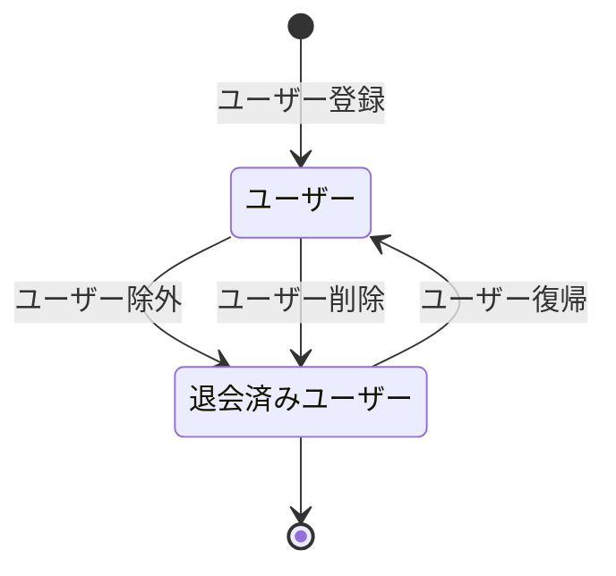
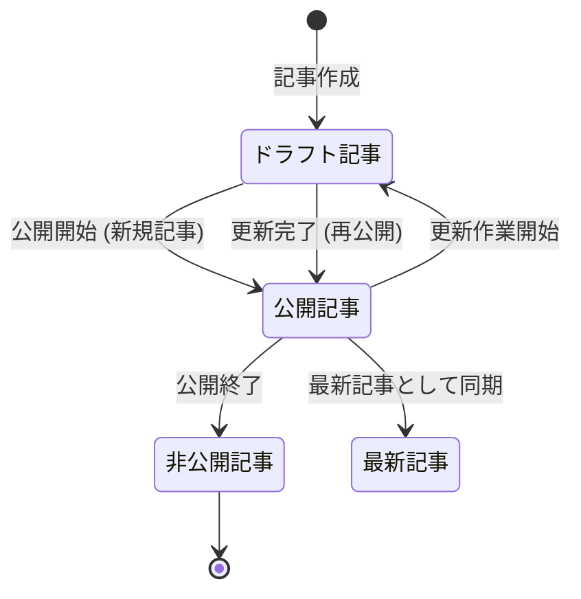
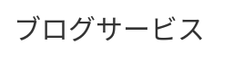

# 5-1

### 仕様整理

### ユーザーの状態遷移

```mermaid
stateDiagram-v2
  active_users: ユーザー
  inactive_users: 退会済みユーザー
  
  [*] --> active_users: ユーザー登録
  active_users --> inactive_users: ユーザー除外
  active_users --> inactive_users: ユーザー削除
  inactive_users --> active_users: ユーザー復帰
  inactive_users --> [*]
```

### 記事の状態遷移

```mermaid
stateDiagram-v2
  Draft: ドラフト記事
  Published: 公開記事
  Private: 非公開記事
  Latest: 最新記事

  [*] --> Draft: 記事作成
  Draft --> Published: 公開開始 (新規記事)
  Published --> Private: 公開終了
    
  Published --> Draft: 更新作業開始
  Draft --> Published: 更新完了 (再公開)
  Published --> Latest: 最新記事として同期
  Private --> [*]
```

```mermaid
---
title: ブログサービス
---
erDiagram
```

### 微妙と思ってること

#### 参考