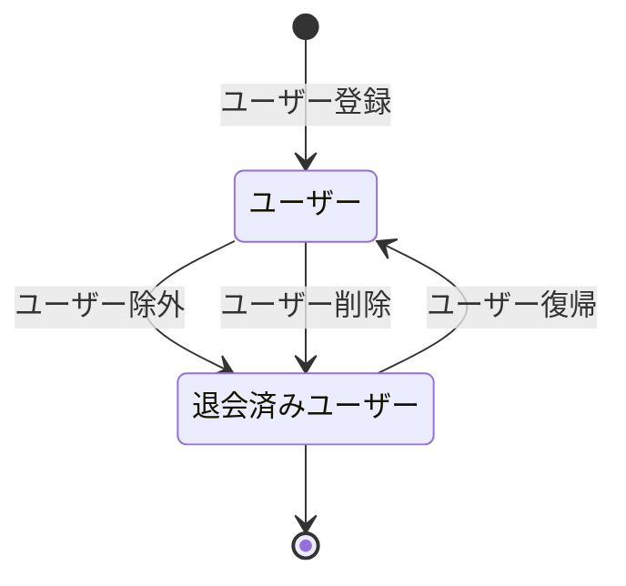
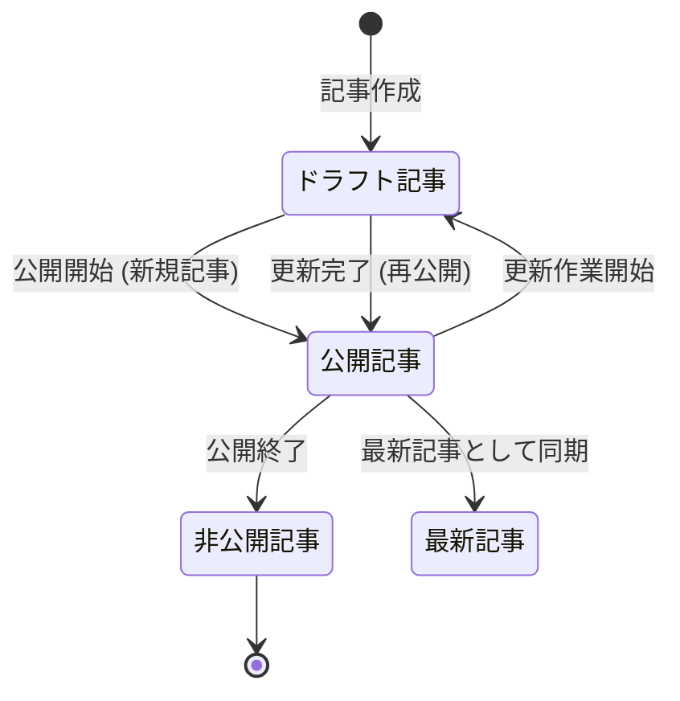
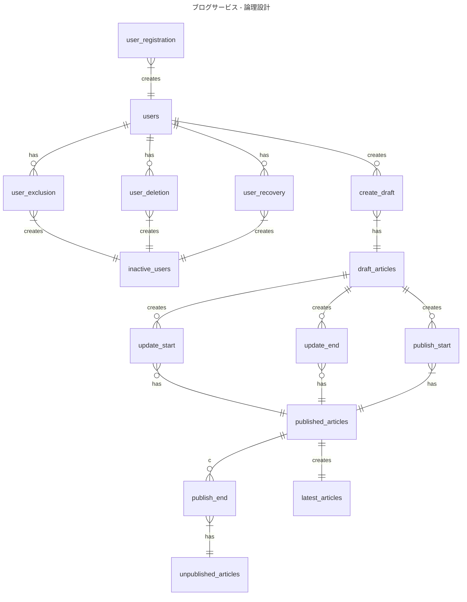
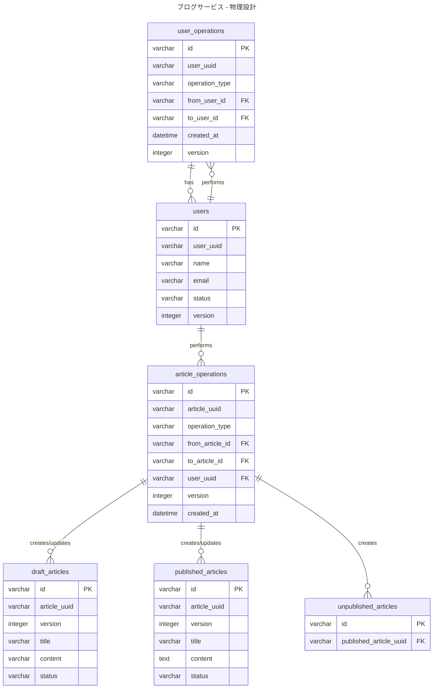

# 5-1

### 仕様整理

### ユーザーの状態遷移

```mermaid
stateDiagram-v2
  active_users: ユーザー
  inactive_users: 退会済みユーザー
  
  [*] --> active_users: ユーザー登録
  active_users --> inactive_users: ユーザー除外
  active_users --> inactive_users: ユーザー削除
  inactive_users --> active_users: ユーザー復帰
  inactive_users --> [*]
```

### 記事の状態遷移

```mermaid
stateDiagram-v2
  Draft: ドラフト記事
  Published: 公開記事
  Private: 非公開記事
  Latest: 最新記事

  [*] --> Draft: 記事作成
  Draft --> Published: 公開開始 (新規記事)
  Published --> Private: 公開終了
    
  Published --> Draft: 更新作業開始
  Draft --> Published: 更新完了 (再公開)
  Published --> Latest: 最新記事として同期
  Private --> [*]
```

```mermaid
---
title: ブログサービス - 論理設計
---
erDiagram
  %% ユーザー(R)
  users {}
  %% 退会済みユーザー(R)
  inactive_users {}
  %% ユーザー登録 (E)
  user_registration {}
  %% ユーザー除外 (E)
  user_exclusion {}
  %% ユーザー削除 (E)
  user_deletion {}
  %% ユーザー復帰 (E)
  user_recovery {}
  %% 記事作成(E)
  create_draft {}
  %% ドラフト記事(R)
  draft_articles {}
  %% 公開開始(E)
  publish_start {}
  %% 記事更新(E)
  update_start {}
  %% 記事更新完了(E)
  update_end {}
  %% 公開終了(E)
  publish_end {}
  %% 公開記事(R)
  published_articles {}
  %% 非公開記事(R)
  unpublished_articles {}
  %% 最新記事(R)
  latest_articles {}

  users ||--o{ create_draft: "creates"
  user_registration }|--|| users: "creates"
  users ||--o{ user_exclusion: "has"
  users ||--o{ user_deletion: "has"
  users ||--o{ user_recovery: "has"
  user_exclusion }|--|| inactive_users: "creates"
  user_deletion }|--|| inactive_users: "creates"
  user_recovery }|--|| inactive_users: "creates"
  create_draft }|--|| draft_articles: "has"
  draft_articles ||--o{ update_start: "creates"
  draft_articles ||--o{ publish_start: "creates"
  draft_articles ||--o{ update_end: "creates"
  published_articles ||--o{ publish_end: "c"
  update_start }o--|| published_articles: "has"
  update_end }o--|| published_articles: "has"
  publish_start }|--|| published_articles: "has"
  publish_end }|--|| unpublished_articles: "has"  
  published_articles ||--|| latest_articles: "creates"
```

```mermaid
---
title: ブログサービス - 物理設計
---
erDiagram
  %% ユーザー操作(E)
  %% operation_type: "register/update/deactivate/reactivate"
  %% from_user_id: "新規登録時は'new'"
  user_operations {
    varchar id PK
    varchar user_uuid
    varchar operation_type
    varchar from_user_id FK 
    varchar to_user_id FK
    datetime created_at
    integer version
  }

  %% ユーザー(R)
  %% status: "active/inactive"
  users {
      varchar id PK 
      varchar user_uuid
      varchar name
      varchar email
      varchar status
      integer version
  }

  %% 記事操作(E)
  %% operation_type: "create_draft/publish_start/update_start/update_end/publish_end/draft_delete"
  %% user_uuid: "操作したユーザー"
  article_operations {
      varchar id PK
      varchar article_uuid
      varchar operation_type
      varchar from_article_id FK
      varchar to_article_id FK
      varchar user_uuid FK
      integer version
      datetime created_at
  }

  %% ドラフト記事(R)
  %% status: "draft/updating/deleted"
  draft_articles {
      varchar id PK
      varchar article_uuid
      integer version
      varchar title
      varchar content
      varchar status 
  }

  %% 公開記事(R)
  %% status: "published/updating"
  published_articles {
      varchar id PK
      varchar article_uuid 
      integer version
      varchar title
      text content
      varchar status
  }

  %% 非公開記事(R)
  unpublished_articles {
      varchar id PK
      varchar published_article_uuid FK
  }

  users ||--o{ user_operations: "performs"
  user_operations ||--o{ users: "has"
  users ||--o{ article_operations: "performs"
  article_operations ||--o{ draft_articles: "creates/updates"
  article_operations ||--o{ published_articles: "creates/updates"
  article_operations ||--o{ unpublished_articles: "creates" 
```

### 微妙と思ってること

TODO 
- どこにインデックスはるかとかまでを決めてからDoneにする
- テーブルとしてはシンプルになったが、どこにインデックスはるか、複合キーとするかとかは考えもの

#### 参考

