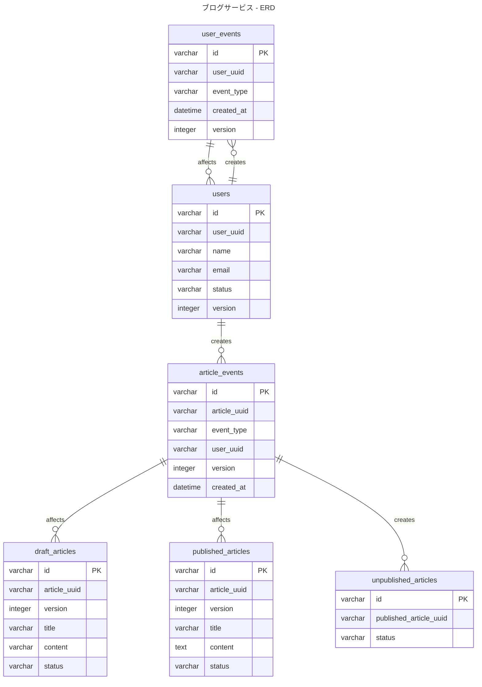

# 5-1

### 設計意図
- ユーザーとブログの状態遷移を明示したうえで、仕様を満たすようにテーブル設計しました。
- 論理設計時点では、各イベントをテーブルにしましたが、物理設計ではそれらをまとめる判断をしました。
  - 理由
    - テーブルの数が多くなってしまい、毎度JOINしないと必要な情報を取得できない
    - 状態遷移図がそのままテーブルに反映された形になっていまい、同列にならぶと違和感のあるものがあったため
      - ドラフト記事を公開開始/終了というイベントとドラフト/公開済みの記事を更新開始/更新終了するというイベントがあった

### ユーザーの状態遷移

### 記事の状態遷移

### 微妙と思ってること

#### 参考
