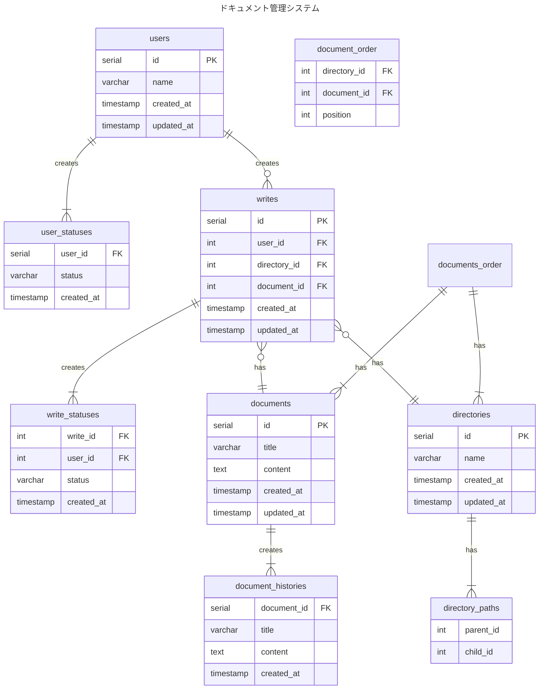

### アンチパターンと初回のDB設計で微妙だったところを見直し

- データモデルとしての不整合が起きてるところを治す
- Fractional Indexingに対応する

```mermaid
---
title: ドキュメント管理システム
---
erDiagram
    user_statuses {
        serial user_id FK
        varchar status
        timestamp created_at
    }
    users {
        serial id PK
        varchar name
        timestamp created_at
        timestamp updated_at
    }
    writes {
        serial id PK
        int user_id FK
        int directory_id FK 
        int document_id FK
        timestamp created_at
        timestamp updated_at
    }
    write_statuses {
        int write_id FK
        int user_id FK
        varchar status
        timestamp created_at
    }
    documents {
        serial id PK
        varchar title
        text content
        timestamp created_at
        timestamp updated_at
    }
    document_histories {
        serial document_id FK
        varchar title
        text content
        timestamp created_at
    }
    document_order {
        int directory_id FK
        int document_id FK
        int position
    }
    directories {
        serial id PK
        varchar name
        timestamp created_at
        timestamp updated_at
    }
    directory_paths {
        int parent_id
        int child_id
    }
    
    users ||--o{ writes: "creates"
    users ||--|{ user_statuses: "creates"
    writes }o--|| documents: "has"
    writes }o--|| directories: "has"
    writes ||--|{ write_statuses: "creates"
    directories ||--|{ directory_paths: "has"
    documents ||--|{ document_histories: "creates"
    documents_order ||--|{ documents: "has"
    documents_order ||--|{ directories: "has"
```
