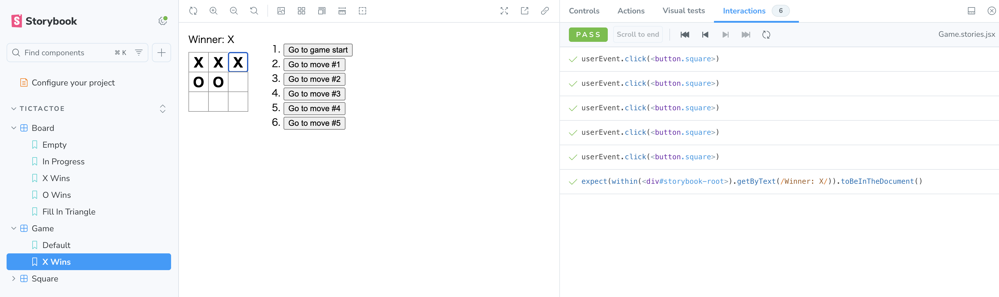

### 課題1-1
以下のチュートリアルを実施してください。
https://ja.react.dev/learn/tutorial-tic-tac-toe

実施済み
- https://github.com/ttakuma17/til/blob/main/test/component-test/vite-tutorial

### 課題2-1

ReactのTutorialで作成したマルバツゲームのコンポーネントにStorybookを組み込んでみましょう。

導入済み
- https://github.com/ttakuma17/til/blob/main/test/component-test/vite-tutorial
  - .storybook
  - src/stories
  - packages.json 

## 課題2-2

以下のコンポーネントのStoryを、最低でも1つずつ作成しましょう。

- Board
    - https://github.com/ttakuma17/til/blob/main/test/component-test/vite-tutorial/src/stories/Board.stories.jsx
- Square
    - https://github.com/ttakuma17/til/blob/main/test/component-test/vite-tutorial/src/stories/Square.stories.jsx
- Game
    - https://github.com/ttakuma17/til/blob/main/test/component-test/vite-tutorial/src/stories/Game.stories.jsx

## 課題2-3

盤面を△で埋め尽くした状態のboardのstoryを作ってみましょう。

余裕のある人は、様々な種類のstoryを作ってみましょう。

- https://github.com/ttakuma17/til/blob/62eecd2f57e9e7b8d8e388e500041e23d0ba056c/test/component-test/vite-tutorial/src/stories/Board.stories.jsx#L41

## 課題2-4

Storybookの[Play function](https://storybook.js.org/docs/writing-stories/play-function)機能を使って、Gameコンポーネントのstoryにインタラクションのテストを追加してみましょう。

### 課題 3-1
Storybookを使って開発することのメリットとデメリットを、それぞれ3つ考えてみて下さい。
- メリット
  - コンポーネント単体で開発しやすい
    - 状態に基づくUIの変化を再現できるので、アプリケーションの実装によらず開発を進められる
  - 状態ごとのUIのテストができる
    - Storyのargsをかえるだけで、状態の再現ができるので、各状態のときの振る舞いの確認がしやすい
      - デザイナーがチェックするみたいなときにもやりやすい
      - Storybookって静的サイトとしてデプロイできるようなので、共有もしやすそう
        - https://storybook.js.org/tutorials/intro-to-storybook/react/ja/deploy/
  - バックエンドの実装まちとか、、デザイナーとの予定調整とか人との調整を待たなくてもUIを先に実装できたりするのが嬉しそう
- デメリット
  - 本番環境との差異が必ず生まれる
    - 発生しえない状態の再現ができたりするので、それを仕様と誤認されてしまう
  - Storybook自体のメンテナンスコストが発生する 
  　- UIを触るたびに、StoryBookの更新も必要になる

### 課題 3-2
課題2-4でマスを選択する際、どのマスをクリックするか指定するために、実装に変更を加える必要があるかもしれません。テストを書きやすくするためにはどのような実装になるのが理想的でしょうか？
- https://testing-library.com/docs/queries/about/#priority

### 課題4-1 (クイズ)
- Storybookで自動テストを実行するときの実装方法はどのようなものがありますか？
- Storybookでスナップショットテストを書くときの設定方法は?
- Storybookで使用するファイルを実装時にまとめて作りたいです。どのように実装すれば実現できますか？