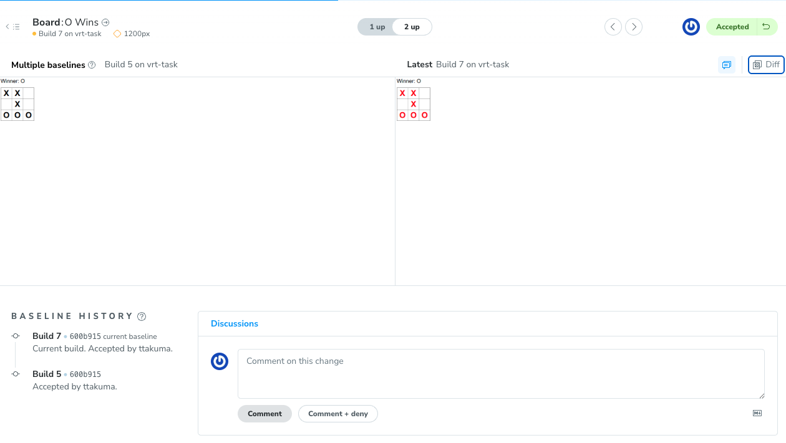
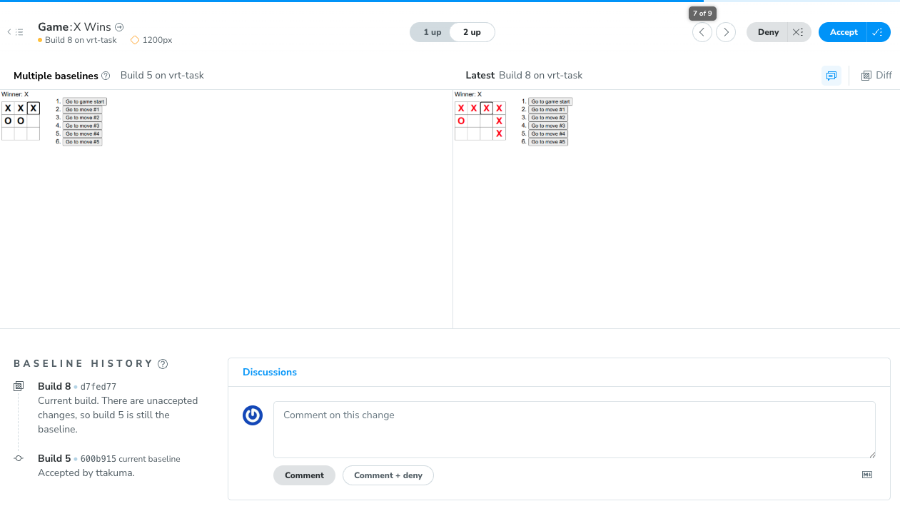

### 課題1-1

reactチュートリアルで作成したマルバツゲームのビジュアルリグレッションテストを実装してください

- 公式で出してるpluginを使って実装してみる
  - https://storybook.js.org/blog/visual-tests-addon-beta/

### 課題1-2

Squareの中身（o, x）を赤色に変えて、ビジュアルリグレッションテストが変更を検知していることを確認してください。

変更を検知していることが確認できたら、変更を受け入れて、スクリーンショットを更新しましょう。

### 課題1-3

間違って3x3ではなく4x3のBoardを作成し、ビジュアルリグレッションテストが変更を検知していることを確認してください。

変更を検知していることが確認できたら、変更を拒否し、スクリーンショットが更新されていないことを確認してください。

- Chromaticを使えるようにした、Deniedにした後にStoryBook側のスナップショットみると更新されてるように見えた。
- Changes Detectedされるか、Run Tests実行したら、Acceptしようが、Denyしようが自動でスナップショット一旦更新される？　というところがちょっとよくわからない

### 課題2-1

ビジュアルリグレッションテストを用いることで、どのような不具合が防止できるでしょうか？具体的な例を3つ挙げてみてください

- 静的なコンポーネントの意図しない変更
  - ボタンのスタイル変わったとか、フォントサイズ変わってる、padding, margin変わったなど
- レイアウト崩れ
  - GameのBoardのマス目ズレていたなど
- レスポンシブデザインの崩れ
  - SPのデザインが崩れていて、要素見えないなど

まとめ
- 意図しないUIの変化による、ユーザーの利便性低下やサイトのデザインの統一感の欠如などを防ぐことができる

### 課題2-2

ビジュアルリグレッションテストでは防止できない不具合もあります。具体的な例を3つ上げてみてください。

- 動的なUIの状態変化
  - クリックイベントによる表示
  - X Winsなどのメッセージ表示
- アニメーションなどの動き方の不具合
  - 最終的な状態はわかるが、途中の変遷は追えない
- 入力値によって処理が変わるなどの検証
  - フォームの入力によって、どのようにバリデーションメッセージが変わるか？
  - 正しいタイミングで表示されているかなどは検証できない。
    - 最終的な状態だけ見ても、はじめから表示されてたのか、期待通り入力後に表示されてたのかはわからない

まとめ
- 最終的な状態に至る前の動作が正しいかビジュアルリグレッションテストでは検知できない

### 課題3-1
ビジュアルリグレッションテストに関するクイズを作成してください

- ビジュアルリグレッションテストはどのように動作して差分検証しているか説明してください
- ビジュアルリグレッションテストを行う対象のページに動的な要素が含まれている場合はどう対応しますか？
  - アクセスのたびに画像と説明文字列が変わるなど
- ビジュアルリグレッションテストとUIコンポーネントのテストの目的はどう違いますか？